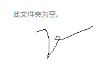

### 基本常见

```
mkdir [选项] [参数]
```

### 分类

```
categories: 
- WEB_JavaScript
tags:
- setTimeout
```



### test

$$
\lim_{x \to 0} f(x) = 8
$$

$$
\int \frac{1}{x} dx = \ln \left| x \right| + C
$$

$$
\lim_{x \to 0} f(x) = 8
$$

### 换行和空格
$$
y=\sin(x) \\
y=\sin(x) \\
y=\sin(x) \\
y=\sin(x) \qquad
y=\sin(x) \qquad
y=\sin(x) \qquad
y=\sin(x)
$$


