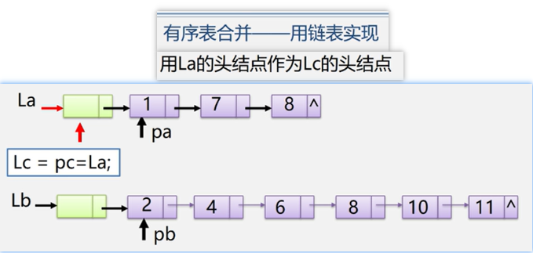

链表

<!-- more -->

### 链表

1. 单链表: 结点只有一个指针域的链表,称为`单链表`活线性链表
2. 双链表:  结点有两个指针域的链表,称为`双链表`
3. 循环链表: 首位相接的链表称为`循环链表`


### 头指针

1. 头指针:  是指向链表中第一个结点的指针
2. 首元结点: 是指链表中存储第一个数据元素a1的结点
3. 头结点: 是在链表的首元节点之前附设的一个结点


### 不带头结点

就是指向不一样,不带头结点直接指向首元节点,带头节点指向头结点

loading...,用的不多,忽略


### 链表特点

1. 结点在存储器中的位置是`任意的`,即逻辑上相邻的数据元素在物理上`不一定相邻`
2. 访问是<font color='#ff6b81'>只能通过头指针</font>进入链表,并通过每个结点的指针域依次向后顺序扫描其余结点,所以寻找第一个结点和最后一个结点所花费的时间不等

### 线性表的链式存储结构

> 线性表中数据元素(结点),在存储器中的位置是任意的,即逻辑上相邻的数据元素在屋里位置上不一定相邻
>
> 1. 单链表: 每个结点只有一个指针域
> 2. 双链表: 每个结点只有两个指针域
> 3. 循环链表: 链表结点首位相接
>
> 

#### 单链表的存储结构

```c
typedef struct Lnode { //声明结点的类型和指向结点的指针类型
    ElemType data;     // 结点的数据域
    struct Lnode *next; // 结点的指针域
} Lnode, *LinkList;    // LinkList为指向结构体Lnode的指针类型


// 其他常见手法
// 定义链表L: LinkList L;
// 定义结点指针p: LNode *p;

// demo: 定义一个链表
typedef struct {
    char num[10]; // 数据域
    char name[8]; // 数据域
    int score; // 数据域
} ElemType;

typedef struct Lnode {
    ElemType data; // 数据域
    struct Lnode *next; // 指针域
} Lnode, *LinkList;
```


### 链表操作

空表: 链表中无元素,成为空链表(头指针和头结点仍然存在);
          判断头结点指针域是否为空;  L->next == NULL

#### 销毁单链表

```c
// 销毁单链表--伪代码
Status DestroyList_L(LinkList &L){
    Lnode *p; // 或者 LinkList p;
    while(L){
        p=L;
        L=L->next;
        delete p;
    }
    return  "Ok"
}
```


#### 清空链表

```c
// 核心代码
p = L->next;

q = p->next;
delete p;

// 反复执行
p = q;
q = q->next;

L->next = NULL;

// 结束条件 p==NULL
// 循环条件: p!=NULL


//demo:清空链表--伪代码
Status ClearList(LinkList &L) { // 将L重置为空表
    Lnode *p, *q; // 或LinkList p,q;
    p = L->next;
    while (p) {
        q = p->next;
        delete p;
        p = q;
    }
    L->next = NULL; // 头结点指针域为空
    return "ok"
}
```


#### 按值查找

```c
// 核心代码
p=L->next;
p=p->next;
p->data!=e; // e为查找的值


// demo:伪代码
Lnode *LocateElem_L(LinkList L, ElemType e) {
    // 在线性表L中查找值为e的数据元素
    // 找到,则返回L中值为e的数据元素的地址,查找失败返回NULL
    p = L->next;
    while (p && p->data != e) {
        p = p->next;
    }
    return p;
}
```


#### 插入

```c
// 核心代码(顺序不能错)
s->next=p->next;
p->next=s;

// demo:伪代码; 
// 在L中第i个元素之前插入数据元素e
Status ListInsert_L(LinkList &L, int i, ElemType e) {
    p = L;
    j = 0;
    while (p && j < i - 1) { // 寻找第i-1个结点,p指向i-1结点
        p = p->next;
        ++j
    }
    // 非法位置
    if (!p || j > i - 1)return ERROR
    // 生成新结点s,将结点s的数据域置为e    
    s = new LNode;
    s->data = e;
    // 将结点s插入L中
    s->next = p->next;
    p->next = s;
    return 'ok';
}
```


#### 删除

```c
// 核心代码
p->next = p->next->next;

//demo:伪代码; 删除第i个结点
Status ListDelete_L(LinkList &L, int i, ElemType e) {
    p = L;
    j = 0;
    while (p->next && j < i - 1) { // 寻找第i个结点,并令p指向其前驱
        p = p->next;
        ++j
    }
    // 非法位置
    if (!p->next || j > i - 1)return ERROR
    q = p->next; // 临时保存被删除结点以备释放
    p->next = q->next; // 改变删除结点前驱的指针
    e = q->data; // 保存删除结点的数据域
    delete q; // 释放删除结点的数据域
    return 'ok';
}
```


### 循环链表

循环链表中没有`NULL`指针,故涉及遍历操作时,其`终止条件`就不像`非循环链表`那样判断`p 或者 p->next`是否为空,而是判断他们`是否等于头指针`

 循环条件如下

| 单链表          | 单循环链表   |
| --------------- | ------------ |
| p != NULL       | p != L       |
| p->next != NULL | p->next != L |
|                 |              |

带`尾指针`循环链表的合并

```c
// demo:伪代码
LinkList Connect(LinkList Ta, LinkList Tb) { // 假设Ta,Tb都是非空的单循环链表
    p = Ta->next; // p存储表头结点
    Ta->next = Tb->next->next; // Tb表头连结Ta表尾
    delete Tb->next; // 释放Tb表头结点
    Tb->next = p; // 修改指针
    return Tb;
}
```

### 双向链表

```c
// 结构定义
typedef struct DulNode {
    Elemtype data;
    struct DulNode *prior, *next;
} DulNode, *DuLinkList;
```


#### 双向链表插入

```c
// 插入 核心代码
s->prior = p->prior;
p->prior->next = s;
s->next = p;
p->prior = s;

// 删除 核心代码
p->prior->next = p->next;
p->next->prior = p->prior;
```


### 总结整理顺序表和链表

链式存储结构优点

> 1. `结点空间`可以动态申请和释放;
> 2. 数据元素的逻辑依次序靠结点的指针来指示,`插入和删除时不需要移动数据元素`
>
> 适用场景:
>
> 1. 表长度变化不大,且能事先确定变化范围
> 2. 很少进行插入或删除操作,经常按元素位置序号访问数据元素

链式存储结构缺点

> 1. 存储密度小,每个结点的指针域需要额外的占用存储空间,当每个结点的数据域所占字节不多时,指针域所占存储空间的比重显得很大
> 2. 链式存储结构是`非随机存储`结构,对任一结点的操作都需要从头指针依指针链查找到该结点,这增加了算法的复杂度
>
> 适用场景:
>
> 1. 长度变化较大
> 2. 频繁进行插入或删除操作

### demo

有序表合并( 用链表实现 )

```c
// 算法复杂度O(listLength(La) + listLength(Lb) )
void MergeList_L(LinkList &La, LinkList &Lb, LinkList &Lc){
    pa = La->next; pb = Lb->next;
    pc = Lc = La; // 用La的头结点作为Lc的头结点
    while(pa && pb){
        if(pa->data<=pb->data){
            pc->next = pa;
            pc = pa;
            pa = pa->nex;
        }else{
            pc->next = pb;
            pc = pb;
            pb = pb->next;
        }
    }

    pc->next = pa ? pa : pb; // 插入剩余段
    delete Lb; // 释放Lb的头结点
}
```




### demo2

```c
struct Book{ // 图书管理
    char id[20]; // ISBN
    char name[50]; // 书名
    int price; // 定价
};

typedef struct { // 顺序表实现
    Book *elem;
    int length;
}SqList;
```

```c
struct Book{ // 图书管理
    char id[20]; // ISBN
    char name[50]; // 书名
    int price; // 定价
};

typedef struct LNode{ // 链表实现
    Book data;
    struct LNode *next;
}LNode,*LinkList;

```

### 练习题

1. 设线性表以不带头结点的单向链表存储，链表头指针为head，以下程序的功能是输出链表中各结点中的数据域data,完成程序中空格部分 

   > ```c
   > #define NULL 0
   >     void main（ ） {
   >         NODE  *head ,*p ;
   >         p=head;    /*p为工作指针*/
   >      do{ 
   >          printf(“%d\n”,  [  1  ] ); //p->data
   > 		[      2        ];  // p=p->next
   >      }while ( [      3  ];)  //p!=NULL
   > }
   > 
   > ```
   >
   > 

2. 设有一个头指针为head的不带头结点单向链表，p、q是指向链表中结点类型的指针变量，p指向链表中结点a, （设链表中没有结点的数据域与结点a的数据域相同）,写出相关语句

    (1)使该单向链表成为单向循环链表

    (2)插入结点s,使它成为a结点的直接前驱

   > ```c
   > q=p; x=p->data;
   > while（[     4       ]）{// q->next!=NULL
   > 	q=q->next;
   > }
   > q->next=head;
   > q=p;
   > p=p->next;
   > while(p->data!=x)
   > { 	
   >     q=p;
   > 	[      5        ] //p=p->next
   > }
   > s->next=p;
   > [    6     ] //q->next=s
   > 
   > ```
   >
   > 

3. xxx

### 底部

没有了


