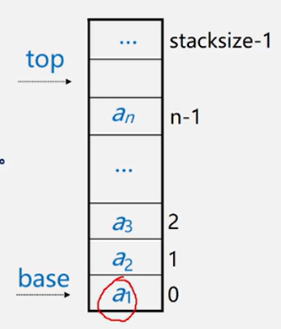
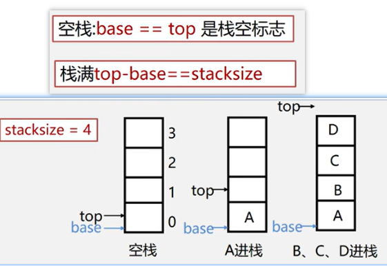
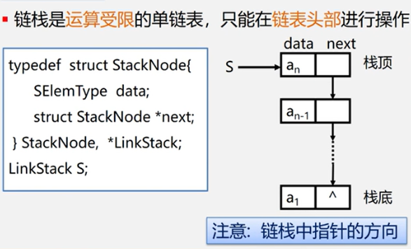

第4章,栈

<!-- more -->

栈(stack),是一个特殊的线性表,是限定仅在一端(通常是表尾[栈顶] )进行插入和删除操作的线性表;

又称为<font color="#ff6b81">后进先出</font>(Last In First Out)的线性表,简称`LIFO`结构

表尾(即An端)称为栈顶`Top`, 表头(即A1端)称为栈底`Base`

```html
例如: 栈 S = ( A1,A2,A3,...,An-1,An)
             A1栈底------------An栈顶
```

插入元素到栈顶(即表尾)的操作,称为`入栈(PUSH)` 
从栈顶(即表尾)删除最后一个元素的操作,称为`出栈(POP)`

举例:

> demo1:
> 假设有3个元素a,b,c;入栈顺序是a,b,c; 则他们的出栈顺序有几种可能
> 解答: 有多重可能这里列举几个: cba, abc,acb,bac,bca;
>
> 但是不会出现cab;[ 自己思考 ]

> demo2:
> 把十进制数159转换成八进制数
> 思路: 除以8,然后把余数放入到栈,然后一次从栈中取值

> demo3:
> 假设表达式中允许包含两种括号: 圆括号和方括号,其嵌套的顺序随意,即:
>
> 1. ( [ ] () ) 或 [ ( [ ] [ ] )]  为正确格式
> 2. [ ( ] )  为错误格式
> 3. ( [ ( ) ) 或 ( ( ) ] )  为错误格式
>
> 思路: 一次放入栈,然后用另一半去栈中匹配,

### 栈的抽象定义

```c
InitStack(&S) // 初始化操作,构建一个空栈 S
DestroyStack(&S) // 销毁栈操作,
StackEmpty(S) // 判定S是否为空栈,返回true或false
StackLength(S) // 求栈的长度,返回长度
GetTop(S, &e) // 取栈顶元素 
ClearStack(&S) //栈置空操作
Push(&S, e) // 入栈操作
Pop(&S, &e) // 出栈操作
    
```





## 顺序栈

```c
// 顺序栈的表示
typedef struct {
    SElemType *base; // 栈底指针
    SElemType *top; // 栈顶指针
    int stacksize; // 栈可用最大容量
} SqStack;
```

```c
// 顺序栈的初始化
Status InitStack(SqStack &S){ // 构造一个空栈
    S.base = new SElemType[MAXSIZE]; // 或者下面
    // S.base = (SElemType*)malloc(MAXSIZE * sizeof(SElemType));
    if(!S.base) exit(OVERFLOW); // 存储分配失败
    S.top = S.base; // 栈顶指针等于栈底指针
    S.stacksize = MAXSIZE;
}
```

```c
// 顺序栈判断是否为空
Status StackEmpty(SqStack S){
    // 若栈为空,返回TRUE,否则返回FALSE
    if(S.top == S.base){
        return true;
    }else{
        return false;
    }
}
```

```c
// 求顺序栈的长度
int StackLength(SqStack S){
    return S.top - S.base;
}
```

```c
// 销毁顺序栈
Status DestroyStack(SqStack &S){
    if(S.base){
        delete S.base;
        S.stacksize = 0;
        S.base = S.top = NULL;
    }
    return OK;
}
```

### 入栈

```c
// 顺序栈的入栈
// 步骤: 1.判断是否栈满,若满则出错(上溢)
//      2.元素e压入栈顶
//      3.栈顶指针加1
Status Push(SqStack &S, SElemType e){
    if(S.top - S.base == S.stacksize){ // 栈满
        return ERROR;
    }
    
    *S.top = e; // 
    S.top++; // 这2步等价 *S.top++=e;
    
    return OK;
}
```

### 出栈

```c
// 顺序栈的出栈
// 步骤:
//  1.判断是否栈空,若空则出错(下溢)
//  2.获取栈顶元素e
//  3.栈顶指针减1
Status Pop(SqStack &S, SElemType &e){
    // 若栈不空,则删除S的栈顶元素,用e返回其值,并返回OK,否则返回ERROR
    if(S.top == S.base){ // 等价 if(StackEmpty(S))
        return ERROR;
    }
   
    --S.top; //
    e = *S.top; // 这2步等价  e = *--S.top; 
    
    return OK;
}
```

## 链栈

1. 链表的头指针就是栈顶
2. 不需要头结点
3. 基本不存在满栈的情况
4. 空栈相当于头指针指向空
5. 插入和删除仅在栈顶出执行



```c
// 判断链栈是否为空
Status StackEmpty(LinkStatck S){
    if(S==NULL) return TRUE;
    else return FALSE;
}
```

```c
// 链栈的入栈
Status Push(LinkStack &S, SElemType e){
    p = new StackNode; // 生成新结点p
    p->data = e; // 将新结点数据域置为e
    p->next = S; // 将新结点插入栈顶
    S = p; // 修改栈顶指针
    return OK;
}
```

```c
// 链栈的出栈
Status Pop(LinkStack &S, SElemType &e){
    if(S == NULL) return ERROR;
    e = S->data;
    p = S;
    S = S->next
    delete p;
    return OK;
}
```

```c
// 取栈顶元素
SElemType GetTop(LinkStack S){
    if(S != NULL){
        return S->data;
    }
}
```

### 练习题

1. 在一个栈顶指针为top的链栈中删除一个结点时，用 x保存被删结点的值，则执行（  ）。

   > ```c
   > x=top->data; top=top->next;
   > ```
   >
   > 

2. 写出下列程序执行后的结果

   > ```c
   > SeqStack S;
   > InitStack(S);
   > Push(S,3);
   > Push(S,4);
   > Push(S,5);
   > int x=Pop(S)+2*Pop(S); //--fei:弹出5,弹出4;X =5+2*4=13
   > Push(S,x);
   > int i,a[4]={5,8,12,15};
   > for (i=0;i<4;i++) Push(S,a[i]);
   > while(!StackEmpty(S)) Printf(“%d  “,Pop(S)); // ---fe依次弹出
   > 执行后的输出结果为：__________________。
   >     A. 15  12  8  5  13  3
   > 
   > ```
   >
   > 

3. .在下面空格处填写一条语句，以使下面的进栈算法完整。

   > ```c
   > void Push(struct SeqStack*s,ElemType x)
   > {
   >        If (s->top==MaxSize-1){
   >          printf(“栈满溢出错误！\n”);
   >          exit(1);
   >        }
   >    ________
   >    s->data[s->top]=x;
   > }
   > 
   > 
   > // C. s->top++;
   > ```
   >
   > 

4. 在下面空格处填写一条语句，以使下面的出栈算法完整。

   > ```c
   > ElemType Pop(struct SeqStack*s,ElemType x)
   > {
   >        If (StackEmpty(s)){
   >          printf(“栈下溢出错误！\n”);
   >          exit(1);
   >        }
   >    x=s->data[s->top];
   >    _________
   >    return x;
   > }
   > 
   > 
   > // A. s->top--;
   > 
   > ```
   >
   > 

5. xxx

### 底部

没有了


