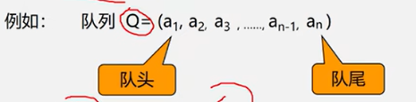
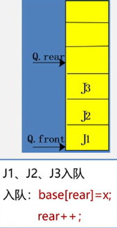
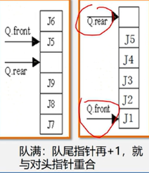

第5章,队列

<!-- more -->

队列,只能在表的一段进行插入运算,在表的另一端进行删除运算的线性表(头删尾插)

队列的存储结构分为 <font color="#ff6b81">顺序队和链队</font>两种(常用循环顺序队)。

队列(Queue)是仅在<font color="#ff6b81">表尾</font>进行插入操作,在<font color="#ff6b81">表头</font>进行删除操作的线性表(先进先出)



### 基本操作

```c
// 顺序队列
#define MAXQSIZE 100 // 最大队列长度
Typiedef Struct{
    QElemType *base; //初始化动态分配存储空间
    int front; // 头指针
    int rear; // 尾指针
}

// 初始
front=rear=0;
// 入队
base[rear]=x;
rear++;
// 出队
x=base[front];
front++;
// 空队
front==rear;
// 注意,超出队列长度后会出现溢出,这时候就可以考虑循环顺序队列
```



### 循环队列

`base[0]` 接在`base[MAXQSIZE-1]`之后,若`rear+1==M`,则领`rear=0`
实现方法: 利用模(mod,C语言中:%)运算

```c
// 插入元素:
Q.base[Q.rear]=x;
Q.rear=(Q.rear+1)%MAXQSIZE;

// 删除元素
x=Q.base[s.front];
Q.front=(Q.front+1)%MAXQSIZE;
```

循环队列满对判断为空方法

1. 另外设一个标志以区别队满、队空
2. 另设一个变量,记录元素个数
3. 少用一个空间( 最常用的方法 )

```c
// 队空: front == rear;
// 队满: (rear+1)%MAXQSIZE == front;
```



```c
// 循环队列的类型定义
#define MAXQSIZE 100; //最大队列长度
typedef struct{
    QElemType *base; // 动态分配存储空间
    int front; // 头指针,若队列不为空,指向队列头元素
    int rear; // 尾指针,若队列不为空,指向队列尾元素的下一个位置
} SqQueue; // 注意这里没有*这个符号


// 循环队列的初始化
Status InitQueue (SqQueue &Q){
    Q.base = new QElemType[MAXQSIZE]; // 分配数组空间
    // Q.base = (QElemType*);
    // malloc(MAXQSIZE*sizeof(QElemType));   // c语言书写,分配空间
    if(!Q.base) exit(OVERFLOW); // 存储分配失败
    Q.front = Q.rear = 0; // 头指针尾指针置为0,队列为空
    return OK;
}

// 循环队列长度
int QueueLength(SqQueue Q){
    return ( (Q.rear-Q.front + MAXQSIZE)%MAXQSIZE );
}

// 循环队列入队
Status EnQueue(SqQueue &Q QElemType e){
    if( (Q.rear+1)%MAXQSIZE == Q.front ) return ERROR; // 对满
    Q.base[Q.rear] = e;   // 新元素加入队尾
    Q.rear = (Q.rear+1)%MAXQSIZE; // 队尾指针加1
    return OK;
}

// 循环队列出队
Status DeQueue(SqQueue & Q QElemType &e){
    if(Q.front == Q.rear) return ERROR; // 队空 
    e=Q.base[Q.front]; // 保存队头元素
    Q.front = (Q.front+1)%MAXQSIZE; // 队头指针+1
    return OK;
}

// 循环队列,取队头元素
SElemType GetHead(SqQueue Q){
    if( Q.front!= Q.rear){ // 队列不为空
        return Q.base[Q.front]; // 返回队头指针元素的值,队头指针不变
    }
}
```

### 链队

若无法估计所用队列的长度,则宜用链队列

```c
// 链队列的类型定义
#define MAXQSIZE 100; // 最大队列长度
typedef struct Qnode{
    QElemType data;
    struct Qnode *next;
}QNode, *QuenePtr;

typedef struct{
    QuenePtr front; // 队头指针
    QuenePtr rea; // 队尾指针
}LinkQueue;
```

```c
// 链队列初始化
Status InitQueue( LinkQueue &Q){
    Q.front = Q.rear = (QueuePtr) malloc(sizeof(QNode));
    if(!Q.front) exit(OVERFLOW);
    Q.front->next = NULL;
    return OK;
}
```

```c
// 链队列销毁 
Status DestoryQueue(LinkQueue &Q){
    while(Q.front){
        p = Q.front->next;
        free(Q.front);
        Q.front = p;
    }
     /** 或者用这个循环,用 Q.rear 代替 p
        while(Q.front){
          Q.rear = Q.front->next;
          free(Q.front);
          Q.front = Q.rear;
        }
      **/

    return OK;
}
```

```c
// 链队列入队
Status EnQueue(LinkQueue &Q, QElemType e){
    p = (QueuePtr)malloc(sizeof(QNode));
    if(!p) exit(OVEFLOW);
    p->data = e;
    p->next = NULL;
    Q.rear->next = p;
    Q.rear = p;
    return OK;
}

// 链队列出队
Status DeQueue(LinkQueue &Q, QElemType &e){
    if(Q.front==Q.rear) return ERROR;
    p = Q.front->next;
    e = p->data;
    Q.front->next = p->next;
    if(Q.rear==p) Q.rear=Q.front;
    delete p;
    return OK;
}
```

```c
// 链队列的队头元素
Status GetHead(LinkQueue Q, QElemType &e){
    if(Q.front == Q.rear) return ERROR;
    e = Q.front->next->data;
    return OK;
}
```

### 练习题

1. 、在一个链队中，假设f和r分别为队头和队尾指针，则删除一个结点的运算为（ C ）。

   > ```c
   > A．r=f->next;    B．r=r->next;   C．f=f->next;   D．f=r->next;
   > ```
   >
   > 

2. 一个链队中，假设f和r分别为队头和队尾指针，则插入s所指结点的运算为（ B）。----fei:在队尾插入

   > ```c
   > A．f->next=s; f=s;               B．r->next=s; r=s;  
   > C．s->next=r; r=s;               D．s->next=f; f=s;
   > 
   > ```
   >
   > 

3. 在下面空格处填写一条语句，以使下面的链式队列全部元素出队的算法完整

   > ```c
   > int write(LinkQueue *q)
   > {
   >     QueueNode *p;
   >     if (q->front == q->rear){　           /*队空*/    
   >     	printf(“队空！无元素可取”);
   >        	exit(0);
   >     }
   >     while (q->front->next != NULL){    
   >         p = q->front->next;
   >         q->front->next = p->next;         /*出队*/     
   >         printf(“%4d”,p->data);
   >         free(p);                      /*释放已出队结点*/
   >     }
   > 	________B_______               /*队空时，头尾指针指向头结点*/
   > }
   > 
   > A. q->front=q->rear;
   > B. q=q->next;
   > C. q->rear=q->front;
   > D. p=p->next;
   > 
   > ```
   >
   > 

4.  在下面空格处填写适当的语句，以使下面的循环队列的入队和出队算法完整。

   > ```c
   > define MAXSIZE 100;
   > typedef char Elemtype;
   > typedef struct
   > {
   >     Elemtype queue [MAXSIZE];
   >     int front,rear;
   > }sequeuetype;
   > Sequeuetype Q;
   > 
   > /*入队算法*/
   > int encqueue(sequeuetype*Q,elemtype x){
   > 	if ((Q->rear+1)%MAXSIZE==Q->front){
   >         printf(“队列已满!\n”);
   >         return 1;
   > 	}else{
   >         Q->rear=(Q->rear+1)%MAXSIZE;     
   >         	(1)  // fei:  Q->queue[Q->rear]=x; 
   >         return 0;
   > 	}
   > }
   > 
   > /*出队算法*/
   > Elemtype  del_cqueue(sequeuetype *Q){
   >      if (       (2)       ){ // ------fei:头和尾相等的时候为空:Q->front==Q->rear  
   >          printf(“队列为空!\n”);
   >          return 1;
   >      }else{
   >          Q->front=(Q->front+1)%MAXSIZE;
   >          return(Q->queue[Q->front]);
   >      }
   > }  
   > 
   > 
   > // D. (1) Q->queue[Q->rear]=x;  (2) Q->front==Q->rear
   > ```
   >
   > 

5. 写出下列程序执行后的结果

   > ```c
   > SeqQueue Q;
   > InitQueue(Q);
   > int a[4]={5,8,12,15};
   > for(int i=0;i<4;i++) InQueue(Q,a[i]);  //-----------fei:把数组a放入队列(5,8,12,15)
   > InQueue(Q,OutQueue(Q));  //-------fei:出队一个元素同时再放入队列(8,12,15,5)
   > InQueue(Q,30);       //---------fei:入队一个元素(8,12,15,5,30)
   > InQueue(Q,OutQueue(Q)+10); // --fei:出队一个元素同时再放入队列(12,15,5,30,18)
   > while(!QueueEmpty(Q)) printf(“%d  ”,OutQueue(Q));
   > 执行后的输出结果为：__________________。
   > 
   > 
   > // B. 12  15  5  30  18
   > 
   > // fei:答案解析说明:
   > // InQueue(Q,OutQueue(Q)+10); 这句话的意思是,弹窗元素8,再运算8+10,然后把18入队
   >     
   > ```
   >
   > 

6. xxx


### 底部

没有了


