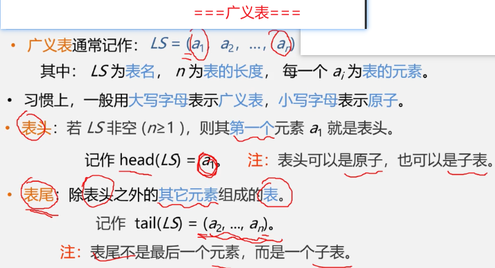
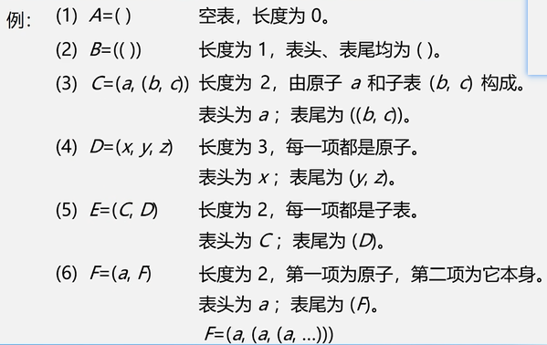
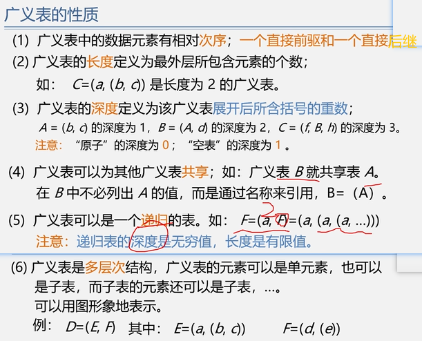
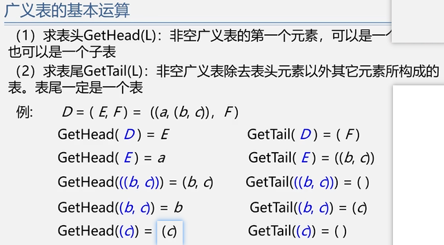

第6章,串、数组、广义表

<!-- more -->

## 字符串

### BF算法

设目标串`S="aaaaabb"`, 模式串`T="aaab"`
S的长度为n(n=6), T的长度为m(m=4)
BF算法的匹配过程如下:  i=0, j=0;

> ```javascript
> // 匹配失败
> i = i-j+1 (回溯)
> j = 0 (从头开始)
> ```
>
> 

| S:   | a    | a    | a    | a    | a    | b    |
| ---- | ---- | ---- | ---- | ---- | ---- | ---- |
| T:   | a    | a    | a    | b    |      |      |

```javascript
// JavaScript 语言实现BF算法
function index_BF(S, T) {
    let i = 0;
    let j = 0;
    while (i < S.length && j < T.length) {
        if (S[i] === T[j]) { //相等就移动指针
            i++;
            j++;
        }else{ //指针归零
            i = i - j + 1;
            j = 0;
        }
    }

    if (j === T.length) {
        return i - T.length; // 成功返回
    }else{
        return -1; // 失败
    }
}

let aStr = 'aaaaabb'; // 主串
let bStr = 'aaab'; // 子串
let fooRes = index_BF(aStr, bStr);
console.log(fooRes); // 输出2
```

```javascript
// JavaScript 语言实现KMP算法
function GetNext(t, arr) {
    let k = -1, j = 0;
    arr[0] = -1;
    while (j < t.length - 1) {
        if (k === -1 || t[j] === t[k]) {
            j++;
            k++;
            arr[j] = k;
        } else {
            k = arr[k];
        }
    }
}

function index_KPM(s, t) {
    let pattern = new Array(t.length);
    let j = 0, i = 0, v = 0;
    GetNext(t, pattern);
    while (i < s.length && j < t.length) {
        if (j === -1 || s[i] === t[j]) {
            i++;
            j++;
        } else {
            j = pattern[j];
        }
    }
    if (j >= t.length) {
        v = i - t.length;
    } else {
        v = -1;
    }
    return v;
}

let aStr = 'aaaaabb'; // 主串
let bStr = 'aaab'; // 子串
let fooRes = index_KPM(aStr, bStr);
console.log(fooRes); // 输出2
```

```c
// 用C语言实现BF算法 和 MPM算法,所有代码如下
// 输出结果
// 		使用BF算法：2
// 		使用KMP算法：2
    
#define _CRT_SECURE_NO_WARNINGS
#include<stdio.h>
#include<stdlib.h>
#include<string.h>
#define MAX_SIZE 255    // 定义字符串的最大长度

typedef unsigned char SString[MAX_SIZE];//数组第一个保存长度
//BF
int index_BF(char *s, char *p) {
    int i, j;
    i = 0;
    while (i < strlen(s)) {
        j = 0;
        while (s[i] == p[j] && j < strlen(p)) {
            i++;
            j++;
        }
        if (j == strlen(p))
            return i - strlen(p);
        i = i - j + 1;                //指针i回溯
    }

    return -1;
}

//KMP ---getNetx
void getNext(char *p, int *next) {
    int j, k;
    next[0] = -1;
    j = 0;
    k = -1;
    while (j < strlen(p) - 1) {
        if (k == -1 || p[j] == p[k]) { // 匹配的情况下,p[j]==p[k]
            j++;
            k++;
            next[j] = k;
        } else { // p[j]!=p[k]
            k = next[k];
        }
    }
}

//KMP
int index_KPM(char *s, char *p) {
    int next[100];
    int i, j;
    i = 0;
    j = 0;
    getNext(p, next);
    while (i < strlen(s)) {
        if (j == -1 || s[i] == p[j]) {
            i++;
            j++;
        } else {
            j = next[j]; //消除了指针i的回溯
        }
        if (j == strlen(p)) {
            return i - strlen(p);
        }
    }
    return -1;
}

int main()
{
    system("chcp 65001"); // 指定编码

    int a, b;
    char s[MAX_SIZE]="aaaaabb", p[MAX_SIZE]="aaab";

   // printf("请输入模式串：");
   // scanf("%s", &s);
   // printf("请输入子串：");
   // scanf("%s", &p);

    a = index_BF(s, p);
    b = index_KPM(s, p);

    if (a != -1) {
        printf("使用BF算法：%d\n", a);
    } else {
        printf("未匹配\n");
    }

    if (b != -1) {
        printf("使用KMP算法：%d\n", a);
    } else {
        printf("未匹配\n");
    }

    system("pause");
}
```


## 数组

loading...


## 广义表









### 练习题

1. 一维数组A采用顺序存储结构，每个元素占用6个字节，第6个元素的存储地址为100，则该数组的首地址是（   ）。

   > ```c
   > /// --fei: X+(6-1)*6=100; 求X的值
   > // 解得X=70
   > ```
   >
   > 

2. 设有一个20阶的对称矩阵A，采用压缩存储的方式，将其下三角部分以行序为主序存储到一维数组B中（数组下标从1开始），则矩阵中元素a9,2在一维数组B中的下标是（  ）。

   > ```c
   > // ---fei: 1+2+3+4+5+6+7+8+9+1+1(正方形的一半,每行逐渐加一的三角形)
   > // 解得: 下标为X=38
   > ```
   >
   > 

3. 广义表的( a , (d,a ,b) , h , (e ,( (i ,j ) ,k )) )深度是（   ）。

   > ```c
   > // --fei:数括号最多的层数
   > // 解得:深度为X=4
   > ```
   >
   > 

4. 下列广义表中的线性表是（  C  ）。

   > ```c
   > A．E(a,(b,c))	
   > B．E(a,E)		
   > C．E(a,b)    // 这个是线性表		
   > D．E(a,L（ ）)
   > ```
   >
   > 

5. xxx

### 底部

没有了


