第7章,树1

<!-- more -->

### 树定义

1. 根: 即根结点(没有前驱驱)
2. 叶子: 即终端结点(没有后继)
3. 森林: 指m棵不相交的树的集合(例如删除A后的子树个数)
4. 有序树: 结点各子树从左至右有序，不能互换(左为第一)
5. 无序树: 结点各子树可互换位置。
6. 双亲:  即上层的那个结点(直接前驱)
7. 孩子:  即下层结点的子树的根(直接后继)
8. 兄弟:  同一双亲下的同层结点(孩子之间互称兄弟)
9. 堂兄弟: 即双亲位于同一层的结点(但并非同一双亲)
10. 祖先: 即从根到该结点所经分支的所有结点
11. 子孙: 即该结点下层子树中的任一结点
12. 结点: 即树的数据元素
13. 结点的度: 结点挂接的子树数
14. 结点的层次:  从根到该结点的层数(根结点算第一层)
15. 终端结点: 即度为0的结点，即叶子
16. 分支结点: 即度不为0的结点(也称为内部结点)
17. 树的度: 所有结点度中的最大值
18. 树的深度(或高度): 指所有结点中最大的层数

### 二叉树的性质

 $10^{20}$

1. 性质1: 在二叉树的第K层上至多有2<sup>K</sup>-1个结点

   > 提问：第K层上至少有  1   个结点

2. 性质2: 深度为k的二叉树至多有有2<sup>K</sup>-1个结点

   > 提问：深度为k时至少有   K  个结点

3. 性质3: 对于任何一棵二叉树，若2度的结点数有n<sub>2</sub>个，则叶子数n<sub>0</sub>必定为n<sub>2</sub>＋1 （即n<sub>0</sub>=n<sub>2</sub>+1）

   > 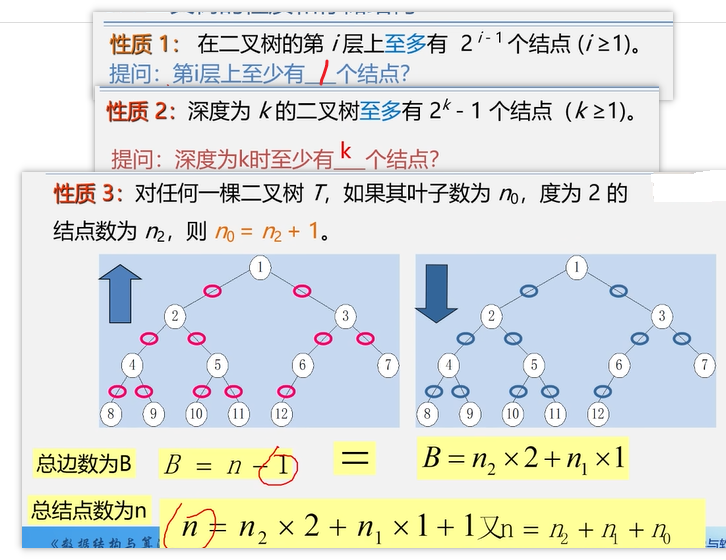
   >
   > 二叉树性质3理解:
   >
   > ```html
   > 任何一棵二叉树中，如果其叶子结点数为 n0 ，度为 2 的结点数为 n2 ，则 n0 = n2 + 1
   > 
   > 一颗二叉树中，除了叶子结点外，剩下的就是度为 1 或 2 的结点了，设 度为 1 的结点数为 n1 ，则二叉树结点总数为 n = n0 + n1 + n2 
   > 
   > 一颗二叉树的分支线总数为结点总数减去 1 (根结点只有分支出去，没有分支进入)， 分支总数代数表达式为 n - 1 = n1 + 2n2 
   > 
   > 根据结点总数和分支总数可推导出等式 n0 + n1 + n2 - 1 =  n1 + 2n2 
   > 
   > 最终可推导得出 n0 = n2 + 1 
   > ```
   >
   > 

4. 性质4: 具有n个结点的完全二叉树的深度必为[log<sub>2</sub>n]＋1

5. 性质5: 对完全二叉树，若从上至下、从左至右编号，则编号为i 的结点，其左孩子编号必为`2i`，其右孩子编号必为`2i＋1`；其双亲的编号必为`i/2`。

   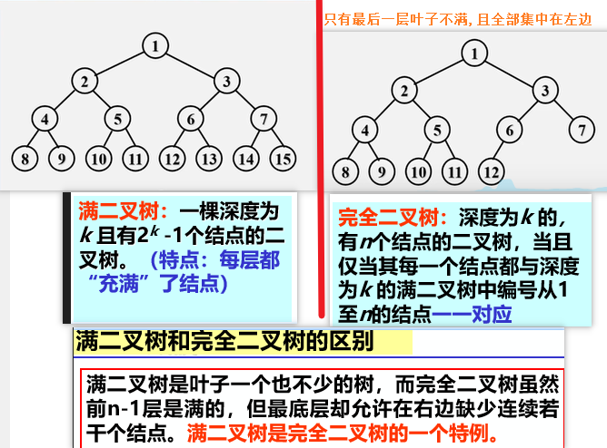

#### 练习

```html
一棵完全二叉树有5000个结点，可以计算出其叶结点的个数是（   2500      ）。 

```


### 二叉链表

在n个结点的二叉链表中，有  `n+1` 个空指针域

```html
分析：必有2n个链域。除根结点外，每个有且仅有一个双亲，所以只结点会有n－1个结点的链域存放指针，指向非空子女结点。
空指针数目 ＝ 2n－(n-1) = n+1

```

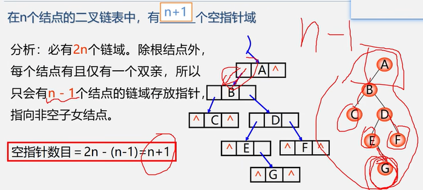

```c
typedef struct BiNode{
   TElemType   data;
   struct  BiNode   *lchild,*rchild; //左右孩子指针
}BiNode,*BiTree; 
```

### 二叉树遍历

```
口诀：
DLR——先序遍历，即先根再左再右
LDR——中序遍历，即先左再根再右
LRD——后序遍历，即先左再右再根

tip:fei: 二叉树的先序,后序(第一个和最后一个可以确定谁是中间的值,)
```

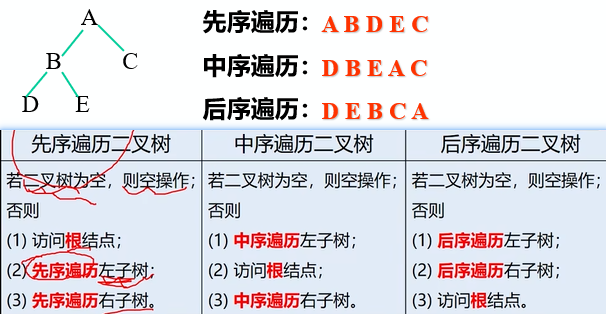

#### 先序遍历

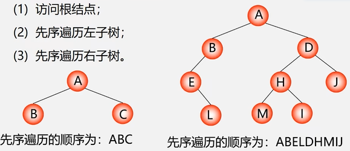

#### 中序遍历

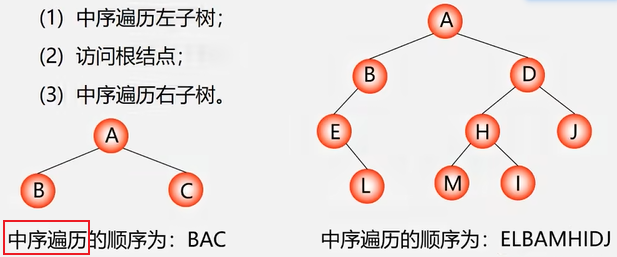

#### 后序遍历

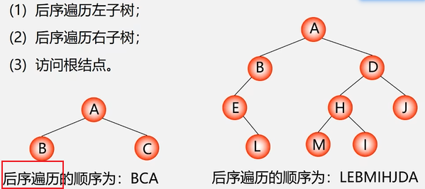

#### 先中后序遍历demo1

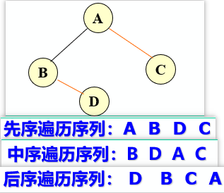


#### 先中后序遍历demo2

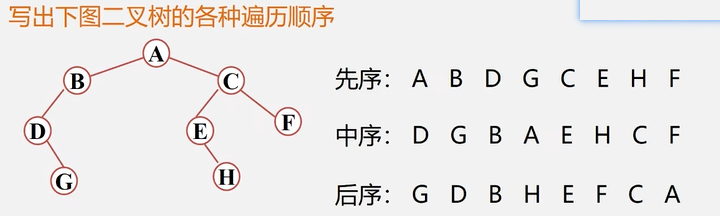

#### 结论

若二叉树中各结点的值均不相同，则：
由二叉树的`前序序列和中序序列`，或由其`后序序列和中序序列`均能唯一地确定一棵二叉树，
但由前序序列和后序序列却不一定能唯一地确定一棵二叉树。 

##### demo1

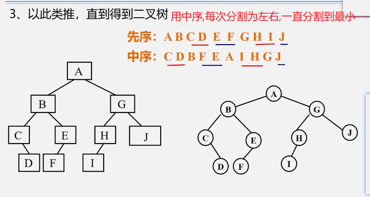

##### demo2

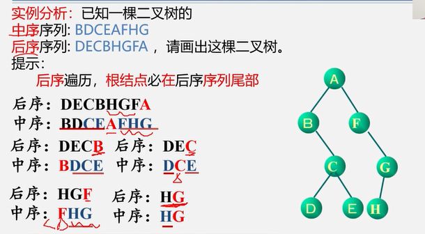

##### demo3

已知一棵二叉树的中序序列和后序序列分别是`BDCEAFHG` 和 `DECBHGFA`，请画出这棵二叉树。

```wiki
1.由后序遍历特征，根结点必在后序序列尾部（A）；
2.由中序遍历特征，根结点必在其中间，而且其左部必全部是左子树子孙（BDCE），其右部必全部是右子树子孙（FHG）；
3.继而，根据后序中的DECB子树可确定B为A的左孩子，根据HGF子串可确定F为A的右孩子；以此类推。

```

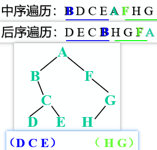

##### demo4

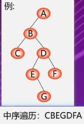

##### demo5

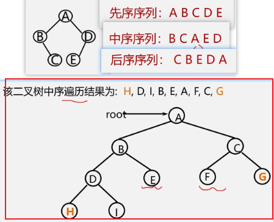


### 底部

没有了


