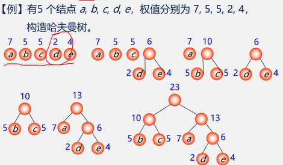

第7章,树2,哈夫曼编码

<!-- more -->

### 哈夫曼树

权(weight): 将树中结点赋给一个有着某种含义的数值则这个数值称为该结点的权。

结点的带权路径长度: 从根结点到该结点之间的路径长度与该结点的权的乘积,

树的带权路径长度: 树中所有叶子结点的带权路径长度之和


### 哈夫曼树:最优树

带权路径长度(WPL)最短的树,

> 带权路径长度最短”是在“度相同”的树中比较而得的结果，因此有最优二叉树、最优三叉树之称等等
>
> 


### 哈夫曼算法

(构造哈夫曼树的方法)


1. (1)根据n个给定的权值{W1，W2，..., Wn)构成棵二树的森林F=(T1，T2，..Tn)，其中Ti只有一个带权为 Wi的根结点。构造森林全是根
2. 在F中选取两棵根结点的权值最小的树作为左右子树，构造一棵新的又树，且设置新的二叉树的根结点的权值为其左右子树上根结点的权值之和。选用两小造新树
3. 在F中删除这两棵树二叉树加入森林中同时将新得到的删除两小添新人
4. 重复(2)和3)，直到森中只有一棵树为止，这棵树即为哈夫曼树

> 口诀:
>
> 1、构造森林全是根; 
> 2、选用两小造新树
> 3、删除两小添新人;
> 4、重复2、3剩单根




### 哈夫曼编码

问题: 什么样的前缀码能使得电文总长最短?

> 1. 统计字符集中每个字符在电文中出现的平均概率(越要求编码越短)
>
> 2. 利用哈夫曼树的特点:权越大的叶子离根越近，将每个字符的概率值作为权值，构造哈夫曼树。 则概率越大的结点，路径越短.
>
> 3. 在哈夫曼树的每个分支上标上0或1:
>
>    ​	结点的左分支标0，右分支标 1, 
>    ​    把从根到每个叶子的路径上的标号连接起来，作为该叶子代表的字符的编码。
>    
>
>    

### 问题

为什么哈夫曼编码能够保证是前缀编码?

```wiki
因为没有一片树叶是另一片树叶的祖先，所以每个叶结点的编码就不可能是其它叶结点编码的前缀
```


为什么哈夫曼编码能够保证字符编码总长最短?

```html
因为哈夫曼树的带权路径长度最短，故字符编码的总长最短
```


### 哈夫曼编码性质

1. 性质1:  哈夫曼编码是前缀码
2. 性质2:  哈夫曼编码是最优前缀码

### demo1


### demo2


### demo3

```wiki
#用哈夫曼编码下面内容
美好的一天开始了,
请大家努力工作,
迎娶白富美,
嫁个高富帅,
踏上人生巅峰
```

### demo4

```html
 利用2、4、5、10这四个值作为叶子结点的权，生成一棵哈夫曼树，该树中所有叶子的最长带权路径长度为（  38 ）
```


### demo5

```html
用权值分别为15，2，4，5的四个结点，构造出的哈夫曼树为（ D ）。
```


