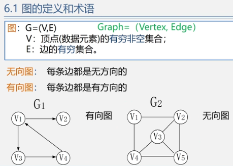
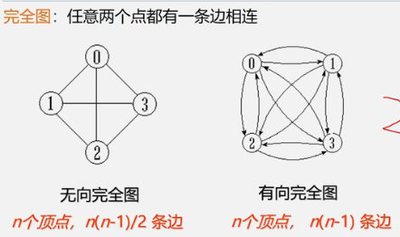
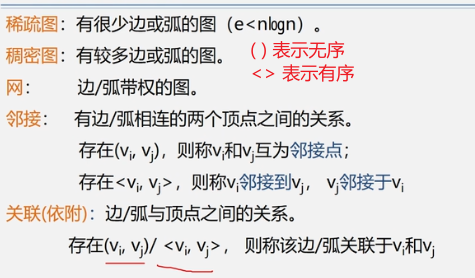
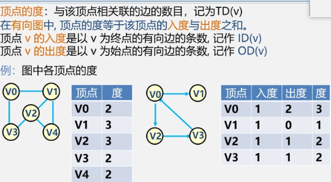
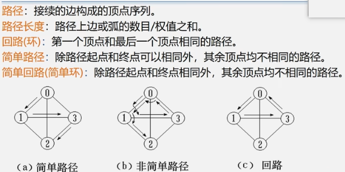
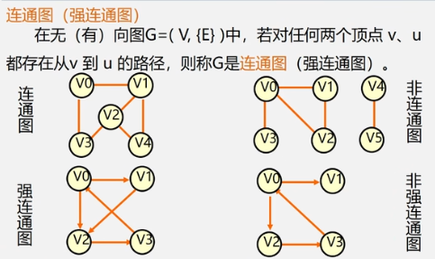
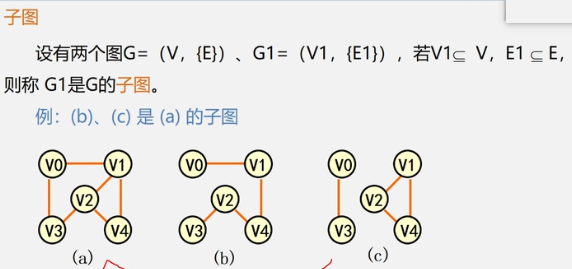
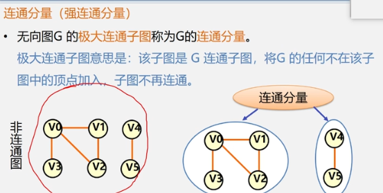
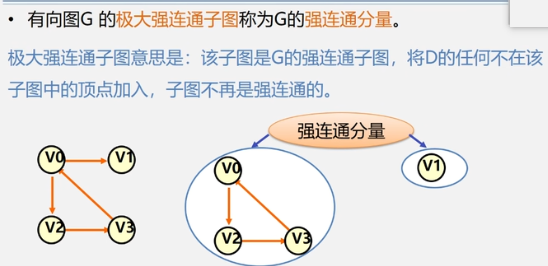
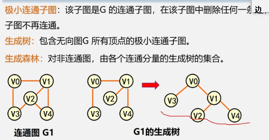

第8章,图

<!-- more -->

### 图的定义

图: G=(VE) ;  全称:Graph= (Vertex, Edge)

```wiki
V: 顶点(数据元素)的有穷非空集合
E: 边的有穷集合。
```

无向图:  每条边都是无方向的

有向图:  每条边都是有方向的





稀疏图:有很少边或弧的图。

稠密图:有较多边或弧的图。

网:边/弧带权的图。

邻接:  有边/弧相连的两个顶点之间的关系

> 存在(V<sub>i</sub>, V<sub>j</sub>)，则称V<sub>i</sub>和V<sub>j</sub>为邻接点;
>
> 存在<V<sub>i</sub>, V<sub>j</sub>>，则称V<sub>i</sub>邻接到V<sub>j</sub>，V<sub>j</sub>领接于V<sub>j</sub>

关联(依附): 边/弧与顶点之间的关系。

> 存在(V<sub>i</sub>, V<sub>j</sub>) /<V<sub>i</sub>, V<sub>j</sub>> 则该边/弧关联V<sub>i</sub> 和 V<sub>j</sub>



顶点的度:与该顶点相关联的边的数目，记为TD(v)

> 在有向图中。顶点的度等于该顶点的入度与出度之和
>
> 顶点 v 的入度是以v为终点的有向边的条数,记作 ID(v)
> 顶点 v 的出度是以v为始点的有向边的条数记作OD(v)
>
> 

路径:  接续的边构成的顶点序列。

路径长度: 路径上边或弧的数目/权值之和。

回路(环): 第一个顶点和最后一个顶点相同的路径。

简单路径:除路径起点和终点可以相同外，其余顶点均不相同的路径。

简单回路(简单环): 除路径起点和终点相同外，其余顶点均不相同的路径。



### 连通图

在无 (有) 向图G=( V,E) )中，若对任何两个顶点 v、u都存在从v 到 u 的路径，则称G是`连通图 `(强连通图)



### 子图



### 连通分量

连通分量 (强连通分量)

无向图G 的极大连通子图称为G的连通分量

极大连通子图意思是: 该子图是 G 连通子图，将G 的任何不在该子图中的顶点加入，子图不再连通。



有向图G 的极大强连通子图称为G的强连通分量

极大强连通子图意思是: 该子图是G的强连通子图，将D的任何不在该子图中的顶点加入，子图不再是强连通的



极小连通子图:  该子图是G 的连通子图，在该子图中删除任何一条边,子图不再连通

生成树:  含无向图G 所有顶点的极小连通子图 

生成森林:  对非连通图，由各个连通分量的生成树的集合。




### 底部

没有了


