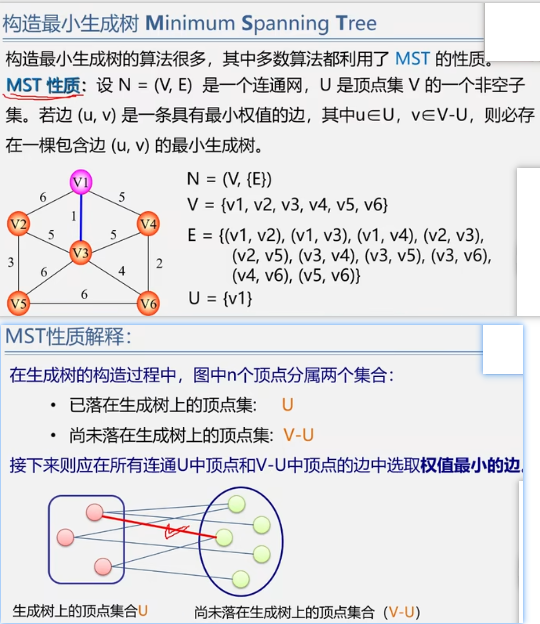
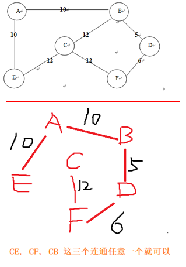

第8章,图

<!-- more -->

### 图的邻接矩阵


### 图的遍历

####  深度优先遍历


#### 广度优先遍历


### 生成树


#### 最小生成树


#### 最小生成树方法一

普利姆(prim)算法


#### 最小生成树方法二


### 最小生成树总结



### 拓扑排序

在AOV网没有回路的前提下，我们将全部活动排列成一个线性序列，使得若 AOV 网中有弧 <i,j>存在，则在这个序列中，i一定排在的前面，具有这种性质的线性序列称为`拓扑有序序列`，相应的拓扑有序排序的算法称为`拓扑排序`

简单理解:   拓扑排序:将有向无环图变成线性序列


AOV网的特点


#### 拓扑排序的一个重要应用

> 检测 AOV 网中是否存在环方法:
> 对有向图构造其顶点的拓扑有序序列，若网中所有顶点都在它的拓扑有序序列中，则该AOV 网必定不存在环

#### 关键路径

暂时忽略,有时间在整理

```wiki
用途：估算工程项目完成时间
AOE网络：定义结点为事件，有向边的指向表示事件的执行次序。单位是时间（时刻）。有向边定义为活动，它的权值定义为活动进行所需要的时间。

术语：
源点：表示整个工程的开始点，也称起点。
收点：表示整个工程的结束点，也称汇点。
事件结点：单位时间，表示的是时刻。
活动（有向边）：它的权值定义为活动进行所需要的时间。方向表示起始结点事件先发生，而终止结点事件才能发生。
事件的最早发生时间（Ve(j)）：从起点到本结点的最长的路径。意味着事件最早能够发生的时刻。
事件的最迟发生时间（Vl (j)）：不影响工程的如期完工，本结点事件必须发发生的时刻。
活动的最早开始时间：e( ai ) = Ve( j )
活动的最迟开始时间：l( ai ) = Vl( k ) - dut( j , k )


事件的最早发生时间（Ve(j)）：从起点到本结点的最长的路径。意味着事件最早能够发生的时刻。
事件的最迟发生时间（Vl (j)）：不影响工程的如期完工，本结点事件必须发发生的时刻。
活动的最早开始时间：e(ai ) = Ve( j )
活动的最迟开始时间： l (ai ) = Vl( k ) - dut( j , k )
关键活动：最早开始时间 ＝ 最迟开始时间的活动
关键路径：从源点到收点的最长的一条路径，或者全部由关键活动构成的路径。


#求关键路径的步骤
01) 求ve(i)、vl(i)
02) 求el(i)、l(i)
03) 计算 l(i)-e(i)
```


### 练习题

1. 画出下列无向网的最小生成树并计算其权值之和

   > 

2. 深度优先

   > 对于一个无向图，假定采用邻接矩阵表示，试分别写出从顶点0出发按深度优先搜索遍历得到的顶点序列。注：每一种序列都是唯一的，因为都是在存储结构上得到的
   >
   > 

3. 邻接表_广度优先

   > 已知图的邻接表，分别给出从顶点3出发用深度优先搜索的遍历序列和从顶点6出发广度优先搜索的遍历序列
   >
   > 结果为:
   >
   > 顶点3出发: 
   > 深度：3，6，5，1，2，4
   > 广度：3，6，2，5，1，4
   >
   > 顶点6出发:
   > 广度: 6, 5, 2, 1, 4, 3
   >
   > 

4. 有向图的邻接矩阵

   > 已知一个有向图的邻接矩阵表示，要删除所有从第i 个结点发出的边，应( B )
   >
   > ```wiki
   > A. 将邻接矩阵的第i行删除
   > B. 将邻接矩阵的第i行元素全部置为0  [fei #选这个]
   > C. 将邻接矩阵的第i列删除
   > D. 将邻接矩阵的第i列元素全部置为0
   > 
   > ```
   >
   > 

5. 在有向图的邻接表中，每个顶点邻接表链接着该顶点所有（ 出边  ）邻接点

   > ---fei: 逆邻接表中( 入边 )

6. G是一个非连通无向图，共28条边，则该图至少有（  9 ）个顶点

   > ---fei: n(n-1)/2 =28,解得n=8; 然后8+1=9
   >
   > ```wiki
   > 答案解析
   > 答:由于G是一个非连通无向图，在边数固定时，顶点数最少的情况是该图由两个连通子图构成，且其中之一只含一个顶点，另一个为完全图。其中只含一个顶点的子图没有边,另一个完全图的边数为n(n-1)/2，即n(n-l)2=28，得n=8。所以，该图至少有 1+8=9 个顶点
   > ```
   >
   > 

7. xxx

8. xxx

### 底部

没有了


