第9章,查找

<!-- more -->

### 数表查找

二叉排序树, 平衡二叉树, 红黑树, B-树, B+树, 键树

#### 二叉排序树

> 二叉排序树或是空树，或是满足如下性质的二叉树：
>
> 1.  若其左子树非空，则左子树上所有结点的值均小于根结点的值；
> 2.  若其右子树非空，则右子树上所有结点的值均大于等于根结点的值；
> 3.  其左右子树本身又各是一棵二叉排序树
>
> 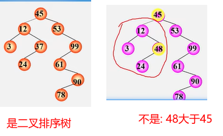
>
> 中序遍历二叉排序树
>
> 二叉排序树的性质: 中序遍历非空的二叉排序树所得到的数据元素序列是一个按关键字排列的<font color="#ff6b81">递增有序</font>序列。
>
> 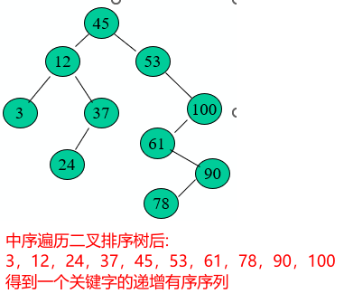

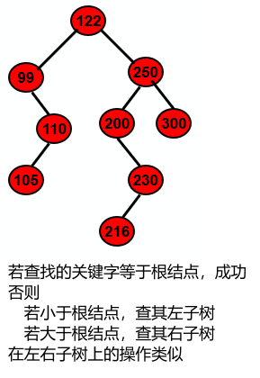

算法思想:

> 1. 若二叉排序树为空，则查找失败，返回空指针。
>
> 2. 若二叉排序树非空，将给定值key与根结点的关键字T->data.key进行比较：
>
>    > 1. 若key等于T->data.key，则查找成功，返回根结点地址；
>    > 2. 若key小于T->data.key，则进一步查找左子树；
>    > 3. 若key大于T->data.key，则进一步查找右子树。

查找分析,平均查找长度

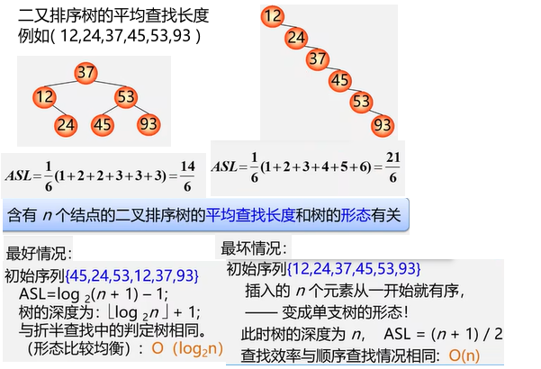

插入结点,生成二叉排序树

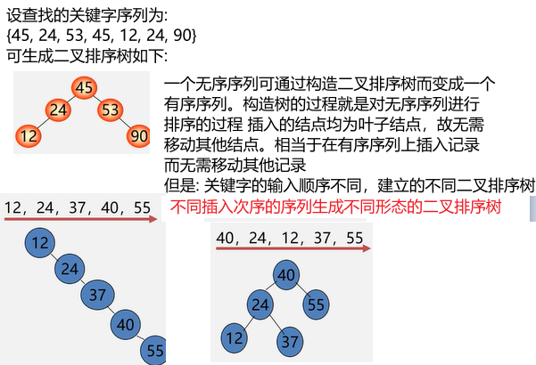

删除操作

> 1. **删除叶结点**，只需将其双亲结点指向它的指针清零，再释放它即可
> 2. **被删结点缺右子树**，可以拿它的左子女结点顶替它的位置，再释放它。
> 3. **被删结点缺左子树**，可以拿它的右子女结点顶替它的位置，再释放它。
> 4. **被删结点左、右子树都存在**，可以在它的右子树中寻找中序下的第一个结点(关键码最小),用它的值填补到被删结点中，再来处理这个结点的删除问题。

#### 平衡二叉树

> 平衡二又排序树定义: ( 又称AVL树(Adelson-Velskii and Landis) )
>
> 一棵平衡二叉树或者是空树，或者是具有下列性质的二叉排序树:
>
> 1. 左子树与右子树的高度之差的绝对值小于等于1;
> 2. 左子树和右子树也是平衡二又排序树
>
> 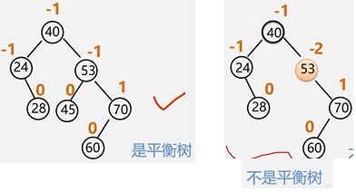
>
> 如果在一棵AVL树中插入一个新结点，就有可能造成失衡，此时必须重新调整树的结构，使之恢复平衡。我们称调整平衡过程为平衡旋转。
>
> ```wiki
> LL平衡旋转
> RR平衡旋转
> LR平衡旋转
> RL平衡旋转
> ```
>
> 

### 哈希表查找

哈希函数解决冲突的方法:

> 1. 开放地址法（线性探测法、二次探测法）
> 2. 链地址法(separate chaining)

1. xxx

散列方法(杂凑法)

> 选取某个函数，依该函数按关键字计算元素的存储位置，并按此存放;
> 查找时，由同一个函数对给定值k计算地址，**将k与地址单元中元素关键码进行比**，确定查找是否成功。
>
> 散列函数(杂凑函数): 散列方法中使用的**转换函数**
>
> 冲 突：不同的关键码映射到同一个哈希地址;  `key1!=key2，但H(key1)=H(key2)`
>
> 同义词：具有相同函数值的两个关键字
>
> 

散列函数的构造方法

使用散列表要解决好两个问题:

> 1. 构造好的哈希函数
>
>    > 1. 所选函数尽可能简单，以便提高转换速度
>    > 2. 所选函数对关键码计算出的地址，应在散列地址集中致均匀分布，以减少空间浪费。
>    >
>    > 哈希函数的构造方法有
>    >
>    > 1. **除留余数法**
>    > 2. **直接定址法 **
>    > 3. 数字分析法
>    > 4. 平方取中法
>    > 5. 折叠法
>    > 6. 随机数法 
>
>    
>
> 2. 制定一个好的解决冲突方案
>
>    > 查找时，如果从散列函数计算出的地址中查不到关键码，则应当依据解决冲突的规则，有规律地查询其它相关单元。

直接定址法

```wiki
Hash(key) = a*key + b  (a、b为常数)
优点：以关键码key的某个线性函数值为哈希地址，不会产生冲突。
缺点：要占用连续地址空间，空间效率低。 

例： {100，300，500，700，800，900}，
     哈希函数Hash(key)=key/100
```

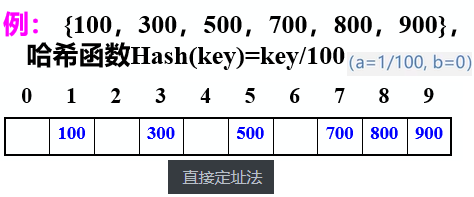

除留余数法

```wiki
Hash(key)=key % p    (p是一个整数)

关键：如何选取合适的p？
技巧：设表长为m，取p≤m且为质数

例: {15，23，27，38，53，61 ,70}, 
散列函数 Hash(key)=key % 7

```

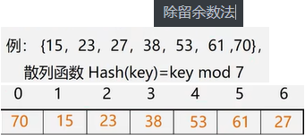

解决冲突 -- 开放地址法(开地址发)

基本思想：有冲突时就去寻找**下一个**空的哈希地址，只要哈希表足够大，空的哈希地址总能找到，并将数据元素存入。 

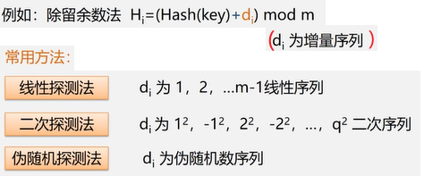

> 1. 线性探测法
>
>    > 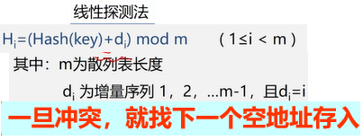
>    >
>    > 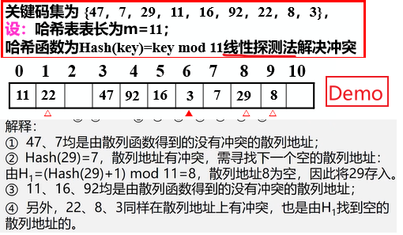
>    >
>    > 优点：只要哈希表未被填满，保证能找到一个空地址单元存放有冲突的元素。
>    > 缺点：可能使第i个哈希地址的同义词存入第i+1个地址，这样本应存入第i+1个哈希地址的元素变成了第i+2个哈希地址的同义词，……，产生“聚集”现象，降低查找效率。
>    > 解决方案：二次探测法
>
> 2. 二次探测法
>
>    > 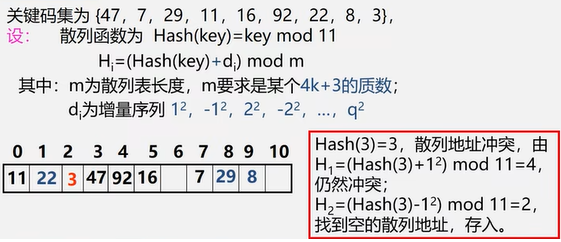
>
> 3. 伪随机探测法
>
>    > 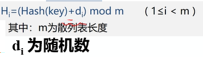

解决冲突 -- 链地址法(拉链法）

> 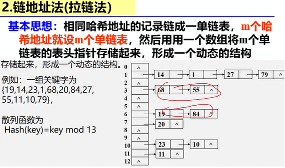
>
> 链地址法建立哈希表步骤
>
> 1. step1 取数据元素的关键字key，计算其哈希函数值（地址）。若该地址对应的链表为空，则将该元素插入此链表；否则执行step2解决冲突。 
> 2. step2 根据选择的冲突处理方法，计算关键字key的下一个存储地址。若该地址对应的链表为不为空，则利用链表的前插法或后插法将该元素插入此链表。

哈希表的查找性能分析

> 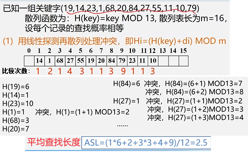
>
> 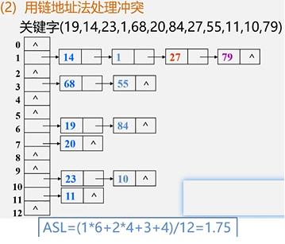
>
> 哈希表的查找效率分析
>
> 使用平均查找长度ASL来衡量查找算法，ASL取决于
>
> 1. 哈希函数
>
> 2. 处理冲突的方法
>
> 3. 哈希表的装填因子
>
>    > 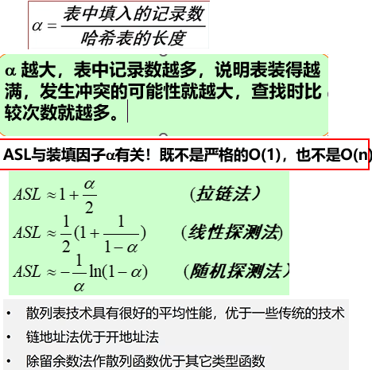


### 底部

没有了


