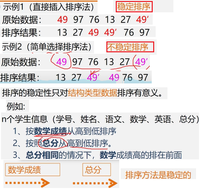
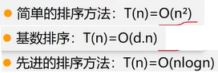
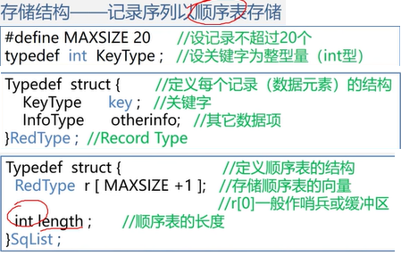

第10章,排序

插入排序、 交换排序、 选择排序、 归并排序、 基数排序、 外部排序、

<!-- more -->

### 排序方法的分类:

1. 按数据存储介质: 内部排序和外部排序 

   > 按存储介质可分为:
   >
   > 内部排序: 数据量不大、数据在内存，无需内外存交换数据
   > 外部排序: 数据量较大、数据在外存(文件排排序)
   >
   > **外部排序时，要将数据分批调入内存来排序，中间结果还要及时放入外存，显然外部排序要复杂得多**

2. 按比较器个数: 串行排序和并行排序

   > 1. 串行排序: 单处理机 (同一时刻比较一对元素)
   > 2. 并行排序: 多处理机 (同一时刻比较多对元素)

3. 按主要操作: 比较排序和基数排序

   > 1. 比较排序: 用比较的方法( 插入排序、交换排序、选择排序、归并排序 )
   > 2. 基数排序: 不比较元素的大小，仅仅根据元素本身的取值确定其有序位置

4. 按辅助空间: 原地排序和非原地排序

   > 1. 原地排序: 辅助空间用量为O(1)的排序方法。(所占的辅助存储空间与参加排序的数据量大小无关)
   > 2. 非原地排序:  辅助空间用量超过O(1)的排序方法

5. 按稳定性: 稳定排序和非稳定排序

   > 1. 稳定排序: 能够使任何数值相等的元素，排序以后相对次序不变(例如: 直接插入排序法)
   > 2. 非稳定性排序: 不是稳定排序的方法(例如: 简单选择排序)
   >
   > 

6. 按自然性: 自然排序和非自然排序

   > 1. 自然排序: 输入数据越有序，排序的速度越快的排序方法
   > 2. 非自然排序: 不是自然排序的方法

1. xxx

### 排序依据原则

1. 插入排序:  直接插入排序、折半插入排序、希尔排序
2. 交换排序:  冒泡排序、快速排序
3. 选择排序:  简单选择排序、堆排序
4. 归并排序:  2-路归并排序
5. 基数排序

### 按排序所需工作量

### 存储结构

记录序列以顺序表存储

### 底部

没有了

