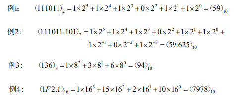

第1章,二进制,真值,原码,反码,补码,移码

<!-- more -->

线性结构分为 顺序存储和链式存储两种。

### 二进制

| 数制 | 十进制数          | 二进制数       | 八进制数       | 十六进制数        |
| ---- | ----------------- | -------------- | -------------- | ----------------- |
| 数码 | 0~9               | 0~1            | 0~7            | 0~9,A~F,a~f       |
| 基   | 10                | 2              | 8              | 16                |
| 权   | 10º ，10¹，10²，… | 2º ，2¹，2²，… | 8º ，8¹，8²，… | 16º ，16¹，16²，… |
| 表示 |                   |                |                |                   |
| 特点 | 逢十进一          | 逢二进一       | 逢八进一       | 逢十六进一        |

表示:  八进制： `4275 = 4*8³ + 2*8² + 7*8¹ + 5*8º`

### 进制之间转换

方法: **按权相加**

步骤：首先进行整数部分转换，然后进行小数部分转换。

(1）整数部分转换
		方法：连续除以基，从低到高记录余数，直至商为0

(2）小数部分转换
	  方法：连续乘以基，从高到低记录整数部分，直至结果的小数部分为0

### 底部

没有了

