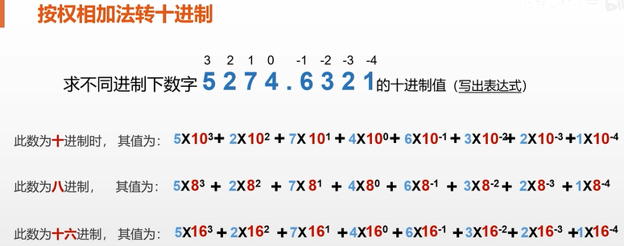
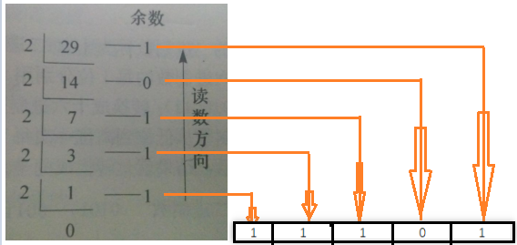
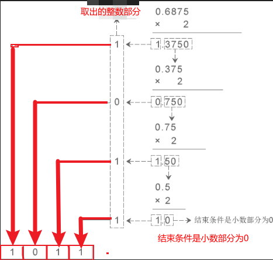

第1章,二进制,真值,原码,反码,补码,移码

<!-- more -->

### 进制表

| 数制 | 十进制数          | 二进制数       | 八进制数       | 十六进制数        |
| ---- | ----------------- | -------------- | -------------- | ----------------- |
| 数码 | 0~9               | 0~1            | 0~7            | 0~9,A~F,a~f       |
| 基   | 10                | 2              | 8              | 16                |
| 权   | 10º ，10¹，10²，… | 2º ，2¹，2²，… | 8º ，8¹，8²，… | 16º ，16¹，16²，… |
| 表示 |                   |                |                |                   |
| 特点 | 逢十进一          | 逢二进一       | 逢八进一       | 逢十六进一        |

表示:  八进制： `4275 = 4*8³ + 2*8² + 7*8¹ + 5*8º`

### 其他转十进制

> ### 将二进制、八进制、十六进制转换为十进制
>
> 方法: **按权相加**
>
> 
>
> 

### 十进制转其他

> ### 将十进制转换为二进制、八进制、十六进制
>
> 步骤：首先进行整数部分转换，然后进行小数部分转换。
>
> (1）整数部分转换
> 		方法：连续除以基，从低到高记录余数，直至商为0
>
> (2）小数部分转换
> 	  方法：连续乘以基，从高到低记录整数部分，直至结果的小数部分为0

####  整数部分

将十进制数（29）转换成二进制数结果为( 11101 )

方法一:



方法二: 

| 2的次方 | 2^5  | 2^4  | 2^3  | 2^2  | 2^1  | 2^0  |
| :-----: | :--: | :--: | :--: | :--: | :--: | :--: |
|   值    |  32  |  16  |  8   |  4   |  2   |  1   |
|   29    |  0   |  1   |  1   |  1   |  0   |  1   |
|         |      |      |      |      |      |      |

从左至右依次开始：比29小的取0, 比29大的取1,

#### demo2 小数部分

将十进制数（0.6875）转换成二进制数结果为( 0.1011 )

```html
0.6875*2 = 1.375 ---> 取个位数1
0.375*2 = 0.75 ---> 取个位数0
0.75*2 = 1.5  ---> 取个位数1
0.5*2 = 1.0  ---> 取个位数1
```




### 扩展

#### 16进制转为2进制

```wiki
只需把每一位，变成二进制的四位数，然后拼在一起

#demo
十六进制 BC.9
二进制   1011 1100. 1001
```


...


### 底部

没有了


