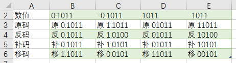

第1章,码制:  真值,原码,反码,补码,移码

<!-- more -->

线性结构分为 <font color="#ff6b81">顺序存储和链式存储</font>两种。

### 带符号数的表示

数的符号表示规则:

`0`表示正号`+`, `1`表示负号`-`

二进制数的码制：原码、反码、补码和移码

### 原码

一个二进制数，用0-1代码表示符号，数值位不变就得到与该二进制数真值对应的<font color="#ff6b81">原码</font>

```wiki
真值: +1001010     -1001010
原码: 01001010     11001010


#字长为8位的原码,表示范围为: -127~+127

[+127] = 0 111 1111
[-127] = 1 111 1111


#数值 0 有两种原码形式:
[+0] = 0 000 0000
[-0] = 1 000 0000

#1和-1的原码
[+1]原 = 0000 0001
[-1]原 = 1000 0001
```

### 反码

```wiki
#正数
正数的反码与原码相同
[X]反 = [X]原
## demo
[X] = +110 1001 (真值+105)
[X]反 = [X]原 =  0 110 1001

#负数
符号位保持1不变, 其余各数值位"按位取反"
## demo
[X]  = -110 1001 (真值-105)
[X]原 = 1 110 1001
[X]反 = 1 001 0110

#其他
字长8位的反码,表示范围为：-127 ～ +127
[+127]反 = 0 111 1111
[-127]反 = 1 000 0000

数值 0 也有两反码形式:
[+0]反 = 0 000 0000
[-0]反 = 1 111 1111
```


### 补码

```wiki
#正数(字长8位)
正数的补码与原码相同
[X]补 = [X]原

#负数(字长8位)
符号位保持1不变, 其余各数值位"按位取反,末位再加1"
## 其他
[X]补 = [X]反 + 1 (即X<0)

#扩展
补码的编码定义:[X]补 = X +2^n (模2^n),n为编码位数
字长8位的补码,表示范围为：-128 ～ +127
[+127]补 = 0 111 1111
[-128]补 = 1 000 0000
补码比原码和反码多表示1个负值，即-128

数值“0”只有1种补码形式：
[+0]补 = [-0]补 = 0 000 0000

```

### 移码

```wiki
移码: 补码的符号位按位取反

移码通常用于表示浮点数的阶码
移码（又叫增码）是符号位取反的补码，一般用做浮点数的阶码，引入的目的是为了保证浮点数的机器零为全0

#demo
阶码的为6位，X表示其真值
[X]移 ＝ 2^5＋X （ -2^5 ＜ X ＜ 2^5 ）

当正数 X ＝ +10101 时, [X]移 ＝ 2^5+X = 110101
当负数 X ＝ -10101 时, [X]移 ＝ 2^5+X
                            ＝ 2^5 - 10101
                            ＝ 001011
                            
移码表示范围与补码一致，0也只有1个移码。
正数：将原码符号位变反，即得到移码。
负数：将原码连同符号位一起变反，末位再加1，即得到移码(与变补等效)。
补码和移码: 符号相反、数值位相同

```

### 小数

1. 带符号的定点小数

   > 约定所有数的小数点的位置，固定在符号位之后
   >
   > ```web-idl
   > 1.0101110
   > 1       .      0101110
   > 符号位  小数点   数值部分
   > ```
   >
   > 

2. 带符号的定点整数

   > 小数点的位置固定在最低数值位之后
   >
   > ```wiki
   > 10101110．
   > 1       0101110     ．
   > 符号位   数值部分   小数点
   > ```
   >
   > 

3. 无符号定点整数

   > 小数点的位置固定在最低数值位之后
   >
   > 

### 浮点数表示原理

浮点表示中，小数点的位置可按需浮动

> ```wiki
> 阶符    阶码位.        数符   .尾数
>     隐含小数点           隐含小数点
> ```
>
> 
>
> 引入浮点数表示的意义
>
> ```wiki
> 浮点数：5位阶码+3位尾数
> 01111 111 ~ 01111 011
> 
> ```
>
> 浮点数的机器(存储)格式
>
> 
>
> > R：阶码的底数，隐含约定为2。
> > E：阶码，定点整数，补码或移码表示，其位数决定了数值的范围；
> > M：尾数，为定点小数，原码或补码表示，其位数决定着数的精度；数符表示数的正负。
>
> 尾数M的规格化表示
>
> ```wiki
> 规格化的目的 → 使浮点数的表示代码“唯一”
> 10进制,科学计数法约定：1 <= |M| < 10
> 则规范形式：128 = 1.28×10^2  (唯一)
> 
> 
> 01)浮点数用原码表示时
> 1/2 <= |M| < 1
> 02)浮点数用补码表示时
> -1 <= M < -1/2    或   1/2 <= M < 1
> 
> 对于原码：规格化以后尾数的最高有效位为"1"
> M原 = 0.1000, 1.1010  ===这里小数后面第一位的"1"就是有效位
> 
> 对于补码：
> 正数，规格化后最高数值位为"1", 如 0.1010,  0.1110  (这里小数后面第一位的"1"就是有效位)
> 负数，规格化后最高数值位为"0", 如 1.0010,  1.0000  (这里小数后面第一位的"0"就是有效位)
> 
> 
> ```
>
> 


### 总结(飞)

```wiki
#对于正数: 原码、反码、补码相同; 移码为补码符号位取反

#对于负数: 
原码: 符号位为1;
反码: 符号位为1，其他位取反，
反码: 原码(符号位不变) 其他位取反
补码: 符号位不变，其反码加1，补码 = 反码 + 1;

移码: 为补码符号位取反
```

```wiki
数值      原码        反码      补码       移码
+0.1011  原 0.1011  反 0.1011  补 0.1011  移 1.1011
-0.1011  原 1.1011  反 1.0100  补 1.0101  移 0.0101
+1011    原 01011   反 01011   补 01011   移 11011
-1011    原 11011   反 10100   补 10101   移 00101

```


```wiki
数值	+0.1011	    -0.1011	      +1011	    -1011
原码	原 0.1011	原 1.1011	原 01011	 原 11011 
反码	反 0.1011	反 1.0100 	反 01011  反 10100
补码	补 0.1011	补 1.0101	补 01011	 补 10101
移码	移 1.1011	移 0.0101	移 11011	 移 00101
```




### demo1

```wiki
x = -0.11101
原码: x = 1.11101
反码: x = 1.00010
补码: x = 1.00011

#demo2
[X]原 = 1 001 1010
[X]反 = 1 110 0101
[X]补 = 1 110 0110

#demo3
[X]补 = 1 110 1100
[X]反 = 1 110 1011
[X]原 = 1 001 0100
```

### demo2

设机器字长16位，定点表示，尾数15位，数符1位，问:
(1)定点原码整数表示时，最大正数、最小负数各是多少?
(2)定点原码小数表示时，最大正数、最小负数各是多少?

```wiki
解:
(1)定点原码整数表示
最大正数值 = 0111 1111 1111 1111 = (2^15-1)10 = (+32767)10
最小负数值 = 1111 1111 1111 1111 = -(2^5-1)10 = (-32767)10

(2)定点原码小数表示
最大正数值 = 0111 1111 1111 1111 =  (1-2^-15)10 = (0.111...11)2
最小负数值 = 1111 1111 1111 1111 = -(1-2^-15)10 = (-0.111..11)2

```


### demo3

把10进制数x=(+128.75)*2^-10写成浮点表示的机器数，阶码，尾数分别用原码，补码表示。设阶码4位，阶符1位，尾数15位，尾数符号1位。


#### demo4

机器字长16位，浮点表示时，阶码5位，阶符1位，数符1位，尾数9位，问: 最大浮点数是多少?最小浮点数是多少


### 变补

```wiki
[X]补的代码连同符号位一起变反，末位再加1，即得到[-X]补

#demo
[X]补 = 0 101 0110   #不区分正负数
        1 010 1001   #连同符号位一起变反
[-X]补= 1 010 1010   #末位加1

```

### 范围

```html
二进制代码   无符号数值    原码值    反码值    补码值
0000 0000	  0 		 0		  0	       0
0000 0001	  1			 1		  1        1
    ┆		  ┆           ┆	       ┆	   ┆
0111 1110	 126	    126	      126	   126
0111 1111	 127	    127	      127	   127

1000 0000	 128	     0	     -127	  -128
1000 0001	 129	    -1	     -126	  -127
1000 0010	 130	    -2	     -125	  -126
    ┆		 ┆           ┆	       ┆	   ┆
1111 1101	 253	    -125	  -2	   -3
1111 1110	 254	    -126	  -1	   -2
1111 1111	 255	    -127	   0	   -1

```


### 其他

三个位能表示的真值

```wiki
111 、110、101、100、011、010、001、000

111 => 3
110 => 2
101 => 1
100 => 0
011 => -1
010 => -2
001 => -3
000 => -4

```

移码的性质:

> - 0是唯一的。
> - 符号位 1表示正，0表示负。
> - x表示范围：-2^(n-1) <= x < 2^(n-1)
> - 移码和真值呈线性正比关系。

#### 原码特点

1. 原码表示直观、易懂，与真值转换容易。

2. 原码中0有两种不同的表示形式，给使用带来了不便。

> 通常0的原码用+0表示，若在计算过程中出现了-0，则需要用硬件将-0变成+0。

3. 原码表示加减运算复杂。

> 利用原码进行两数相加运算时，首先要判别两数符号，若同号则做加法，若异号则做减法。在利用原码进行两数相减运算时，不仅要判别两数符号，使得同号相减，异号相加；还要判别两数绝对值的大小，用绝对值大的数减去绝对值小的数，取绝对值大的数的符号为结果的符号。可见，原码表示不便于实现加减运算。

#### 反码特点

原码最大的问题就在于一个数加上它的相反数不等于0，于是反码的设计思想就是冲着解决这一点，既然一个负数是一个正数的相反数，那干脆用一个正数按位取反来表示负数。

1. 在反码表示中，用符号位表示数值的正负，形式与原码表示相同，即0为正；1为负。
2. 在反码表示中，数值0有两种表示方法。
3. 反码的表示范围与原码的表示范围相同。

#### 补码思想

如果说现在时针现在停在10点钟，那么什么时候会停在八点钟呢？

> 简单，过去隔两个小时的时候是八点钟，未来过十个小时的时候也是八点钟。
> 也就是说时间倒拨2小时，或正拨10小时都是八点钟。
> 也就是10-2=8，而且10+10=8。
> 这个时候满12，说明时针在走第二圈，又走了8小时，所以时针正好又停在八点钟。

所以12在时钟运算中，称之为模，超过了12就会重新从1开始算了。

也就是说，10-2和10+10从另一个角度来看是等效的，它都使时针指向了八点钟。

既然是等效的，那么在时钟运算中，减去一个数，其实就相当于加上另外一个数（这个数与减数相加正好等于12，也称为同余数），这就是补码所谓运算思想的生活例子。

在这里，再次强调原码、反码、补码的引入是为了解决做减法的问题。在原码、反码表示法中，我们把减法化为加法的思维是减去一个数等于加上这个数的相反数，结果发现引入符号位，却因为符号位造成了各种意想不到的问题。

#### 补码特点

1. 在补码表示中，用符号位表示数值的正负，形式与原码的表示相同，即0为正，1为负。但补码的符号可以看做是数值的一部分参加运算。

> 正数的补码表示就是其本身，负数的补码表示的实质是把负数映像到正值区域，因此加上一个负数或减去一个正数可以用加上另一个数（负数或减数对应的补码）来代替。
> 从补码表示的符号看，补码中符号位的值代表了数的正确符号，0表示正数，1表示负数；而从映像值来看，符号位的值是映像值的一个数位，因此在补码运算中，符号位可以与数值位一起参加运算。

2. 在补码表示中，数值0只有一种表示方法。

3. 负数补码的表示范围比负数原码的表示范围略宽。纯小数的补码可以表示到-1，纯整数的补码可以表示到-2^n。

由于补码表示中的符号位可以与数值位一起参加运算，并且可以将减法转换为加法进行运算，简化了运算过程，因此**计算机中均采用补码进行加减运算**

#### 为什么负数的补码的求法是反码+1

因为负数的反码加上这个负数的绝对值正好等于1111，在加1，就是10000，也就是四位二进数的模，而负数的补码是它的绝对值的同余数，可以通过模减去负数的绝对值得到它的补码，所以负数的补码就是它的反码+1。


### 备份

```mysql
CREATE TABLE `01select` (
  `name` text COLLATE utf8_unicode_ci COMMENT '数值',
  `content` text COLLATE utf8_unicode_ci COMMENT '原码',
  `tip` text COLLATE utf8_unicode_ci COMMENT '反码',
  `request` text COLLATE utf8_unicode_ci COMMENT '补码',
  `selA` text COLLATE utf8_unicode_ci COMMENT '移码',
  `selB` text COLLATE utf8_unicode_ci COMMENT 'xxx',
  `selC` text COLLATE utf8_unicode_ci COMMENT 'xxx',
  `selD` text COLLATE utf8_unicode_ci COMMENT 'xxx',
  `selE` text COLLATE utf8_unicode_ci COMMENT 'xxx',
  `answer` text COLLATE utf8_unicode_ci COMMENT 'xxx'
) ENGINE=MyISAM DEFAULT CHARSET=utf8 COLLATE=utf8_unicode_ci;

#SQL 备份
INSERT INTO `test`.`01select`(`name`, `content`, `tip`, `request`, `selA`, `selB`, `selC`, `selD`, `selE`, `answer`) VALUES ('数值', '原码 ', '反码', '补码', '移码', NULL, NULL, NULL, NULL, NULL);
INSERT INTO `test`.`01select`(`name`, `content`, `tip`, `request`, `selA`, `selB`, `selC`, `selD`, `selE`, `answer`) VALUES ('+0.1011', '原 0.1011', '反 0.1011', '补 0.1011', '移 1.1011', NULL, NULL, NULL, NULL, NULL);
INSERT INTO `test`.`01select`(`name`, `content`, `tip`, `request`, `selA`, `selB`, `selC`, `selD`, `selE`, `answer`) VALUES ('-0.1011', '原 1.1011', '反 1.0100 ', '补 1.0101', '移 0.0101', NULL, NULL, NULL, NULL, NULL);
INSERT INTO `test`.`01select`(`name`, `content`, `tip`, `request`, `selA`, `selB`, `selC`, `selD`, `selE`, `answer`) VALUES ('+1011', '原 01011', '反 01011 ', '补 01011', '移 11011', NULL, NULL, NULL, NULL, NULL);
INSERT INTO `test`.`01select`(`name`, `content`, `tip`, `request`, `selA`, `selB`, `selC`, `selD`, `selE`, `answer`) VALUES ('-1011', '原 11011 ', '反 10100', '补 10101', '移 00101', NULL, NULL, NULL, NULL, NULL);


#SQl备份
INSERT INTO `test`.`01select`(`name`, `content`, `tip`, `request`, `selA`, `selB`, `selC`, `selD`, `selE`, `answer`) VALUES ('数值', '+0.1011', '-0.1011', '+1011', '-1011', '', '', NULL, NULL, NULL);
INSERT INTO `test`.`01select`(`name`, `content`, `tip`, `request`, `selA`, `selB`, `selC`, `selD`, `selE`, `answer`) VALUES ('原码', '原 0.1011', '原 1.1011', '原 01011', '原 11011 ', NULL, NULL, NULL, NULL, NULL);
INSERT INTO `test`.`01select`(`name`, `content`, `tip`, `request`, `selA`, `selB`, `selC`, `selD`, `selE`, `answer`) VALUES ('反码', '反 0.1011', '反 1.0100 ', '反 01011 ', '反 10100', NULL, NULL, NULL, NULL, NULL);
INSERT INTO `test`.`01select`(`name`, `content`, `tip`, `request`, `selA`, `selB`, `selC`, `selD`, `selE`, `answer`) VALUES ('补码', '补 0.1011', '补 1.0101', '补 01011', '补 10101', NULL, NULL, NULL, NULL, NULL);
INSERT INTO `test`.`01select`(`name`, `content`, `tip`, `request`, `selA`, `selB`, `selC`, `selD`, `selE`, `answer`) VALUES ('移码', '移 1.1011', '移 0.0101', '移 11011', '移 00101', NULL, NULL, NULL, NULL, NULL);


```


#### 横向

| 数值    | 原码      | 反码      | 补码      | 移码       |
| ------- | --------- | --------- | --------- | ---------- |
| 0.1011  | 原 0.1011 | 反 0.1011 | 补 0.1011 | 移  1.1011 |
| -0.1011 | 原 1.1011 | 反 1.0100 | 补 1.0101 | 移 0.0101  |
| 1011    | 原 01011  | 反 01011  | 补 01011  | 移  11011  |
| -1011   | 原 11011  | 反 10100  | 补 10101  | 移 00101   |

纵向

| 数值 | 0.1011     | -0.1011   | 1011     | -1011     |
| ---- | ---------- | --------- | -------- | --------- |
| 原码 | 原 0.1011  | 原 1.1011 | 原 01011 | 原 11011  |
| 反码 | 反  0.1011 | 反 1.0100 | 反 01011 | 反  10100 |
| 补码 | 补 0.1011  | 补 1.0101 | 补 01011 | 补 10101  |
| 移码 | 移  1.1011 | 移 0.0101 | 移 11011 | 移  00101 |


