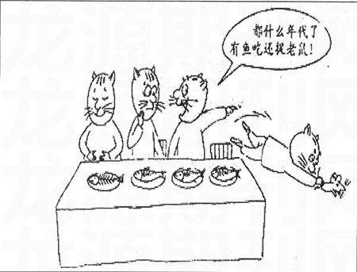

### 2010全国1卷高考作文题目审题点评解析《四只猫抓老鼠漫画》

2010年全国1卷高考语文作文题目：

阅读下面的图画材料,根据要求写一篇不少于800字的文章(60分)。

漫画要素:一张餐桌;四只猫;每只猫前面桌上餐盘里有一条鱼;席间,一只老鼠从旁边跑过,第四只猫毫不犹豫地丢下鱼去捉老鼠,第三只猫指着第四只猫对第二只猫说:“都什么年代了,有鱼吃还捉老鼠!”

要求选准角度,明确立意,自选文体,自拟标题;不要脱离材料内容及含义的范围作文,不要套作,不得抄袭。

## 2010全国1卷高考作文题目审题

**一、审题:**

漫画中的四只猫可分为两大派:

吃鱼派——有鱼可吃,忘记捉老鼠;

捉鼠派——有鱼可吃,仍不忘捉鼠。

1.(批评)吃鱼派:

第一只猫,吃完了面前的鱼,舒服地摸着肚皮,一副悠然自得的样子——它吃得还很“小资”很精致,把鱼骨头完整地留下来,至于有老鼠从旁边跑过,则视而不见,事不关己,高高挂起。

第二只猫,鱼才吃了一半,并扭过脸听第三只猫说话,听后满脸狐疑(到底吃鱼还是捉老鼠),做沉思状,拿不定主意。

第三只猫,态度非常明确,它看到第四只猫放下鱼去捉老鼠时,大声叫道:“都什么年代了,有鱼吃还捉老鼠!”自以为是,自己不捉老鼠,还阻止他人,意见偏颇,做法错误。

2.(表扬)捉鼠派:

第四只猫,虽然面前有鱼,但看到老鼠后仍不顾他人议论嘲笑,坚守本职工作与责任,而不贪图享乐,更不坐享其成,坐吃山空。

3.影射现实:

从图中“吃鱼派”和“捉鼠派”3∶1可知今天恪尽职守的人太少了,一旦有了“鱼”,有了丰富的物质生活,大部分都忘记了自己的本来身份,连本职工作都不想做,贪图享乐,坐享其成而不去奋斗,诸如有些“富二代”和“啃老族”;有的甚至不但自己不做,还对积极分子“刮大风撒蒺藜——连讽刺带打击”,从而引起社会的深层思考。

**二、立意:**

角度一:从“捉鼠派”出发,由虽然有鱼吃,但仍不忘捉老鼠入手:

1.专注于本职工作,不管别人的闲言碎语,甚至冷嘲热讽,不忘自己的本分(本能、本色、本真),坚守职责。

2.在现代社会里,一部分人即使有“鱼”吃,有条件享受,也不忘“捉老鼠”,有高度的责任心;生活质量提高了,更应该居安思危,有忧患意识,努力进取,艰苦奋斗,苦练基本技能(本领)。

角度二:从拥有鱼,而只顾吃鱼,忘记甚至反对捉老鼠的猫入手:

3.有些人的生活本领及生存技能在逐步退化,作为“猫”本应捉“老鼠”,但长期有“鱼”吃,坐享其成,天长日久会忘记甚至不会捉“老鼠”了。

4.社会不良风气及享乐思想的蔓延对年轻一代的影响。

5.不去捉鼠,只坐享父辈钱财而不去奋斗(如啃老族),得过且过,及时行乐,天长日久,终会没饭可吃。

6.不干事的人对实干家们指手画脚,说三道四;现实中有的单位和部门人浮于事,职责不分。

7.追根溯源,揭示出有鱼吃而不去捉鼠的社会根源。是谁为“吃鱼派”提供了这样的条件而让他们失去了捉鼠的本能?可指向家长的纵容、溺爱,越俎代庖及社会不良风气对“啃老族”和一些“富二代”的影响。

**写作指导**

一、漫画作文的解题思路:

第一步:读画面,明白画中有什么

1.看标题。标题是漫画的眼睛,由此可洞察整幅画的主题。因此在审读时首先要看标题是什么,然后再把标题和漫画内容结合起来进行分析,这样就容易弄清楚漫画寓意所在(本题无标题,故无此步)。

2.看画面。漫画是一门绘画艺术,它用简单而又夸张的手法勾画出幽默、诙谐的画面,用以说明某种观点。因此分析漫画的画面是解题的重要环节。漫画画面上的每一个细节都对表达漫画的寓意有提示作用。因此一定要仔细全面地观察画面。

3.看画中字。为了很好地表达寓意,漫画常常配有言简意赅、画龙点睛的句子。所以,在写漫画作文时一定要品味其中的语言文字,认真思考文字所蕴涵的观点,有时它是弄清漫画寓意的金钥匙。

4.看夸张处。漫画为了说明某种观点,常对人物行为或场景加以变形夸张,以引起观众注意,因此,要注意分析漫画的夸张之处。夸张处往往是漫画的弦外之音,是漫画所要表达的真实寓意所在。

第二步:联系现实,展开联想,揣摩画外音

1.看画面指向,对应相关现实;

2.透过现象看本质,跳出画面想画外;

3.多角度思考创作动机是什么,确定最佳立意点。

## 2010全国1卷高考作文题目解析

什么是漫画呢？漫画是一种讽刺性、批评性或幽默性的图画。画家从生活现象中取材，通过夸张、比喻、象征等手法来讽刺、批评或表扬某些人和事。

漫画的特点：

①有针对性。（针对现实生活中的某种现象或某个问题）

②捕捉人事物的本质特征。

③运用变形、夸张、比喻、象征等手法。

④具有幽默或讽刺的效果。

因为漫画多取材于社会现实和热点问题，所以漫画常常具有强烈的时代感和现实性。漫画为了表达其寓意，常常配有言简意赅、画龙点睛的语言文字。解漫画题时还要注意分析漫画的夸张之处。夸张之处往往就是漫画的弦外之音，是漫画所要表达的寓意所在。

因此，我们在解漫画题时，不仅要仔细品味画中的语言文字还要注意漫画细节的夸张，认真思考这些信息中所隐含的观点，有时它就会成为我们弄清漫画寓意的金钥匙。

画中字夸张处——寓意——观点

从审题上看，可以分为捉老鼠的猫和吃鱼的猫两个角度，

首先捉老鼠的猫并没有满足于主人放在餐桌上的美味的食物，而是又通过自己的力量去捉老鼠，由果溯因，我们探究其背后的比喻象征义，我们不难发现，这只捉老鼠的猫有以下几个动机：

1.具有清醒的头脑，有居安思危的忧患意识，当物质生活富足有鱼吃的时候，未雨绸缪，苦练自身本领，这样才能保证不会在灾难降临没有鱼吃的时候措手不及，孟子的“生于忧患死于安乐”，欧阳修的"忧劳可以兴国,逸豫可以亡身"正是这个道理。当大家沉沦之时正是危机到来之际，环境的集体麻木会消磨人的斗志。在物质生活日益丰富的今天，我们不应养尊处优，耽于安乐。人不能只为物质而活着，阳光和营养就在与风雨的搏击中。站在大树下的小树永远长不大，小鸟关进笼中飞不高”即使长大了也没有抗击风雨的能力。如果想要成为一棵参天大树，你就不能沉醉于幸福乡中，必须锻炼自己的毅志，经受风雨的洗礼和考验，擎起一片自己的蓝天。正如陶行知所说：“滴自己的汗，吃自己的饭。自己的事情自己干，靠人靠天靠祖上，不算是好汉。”

2.猫的生存，主要依靠自己的一技之长，就是捉老鼠，要给自己准确定位，自立自强，天行健，君子以自强不息。如果沉湎与享受，就会丧失本能。

3.这只猫不安于现状，心里面有更大奋斗标追求更大的发展。不愿意依附人类，追求更大的生存空间和心灵空间。

4.猫逮老鼠天经地义，坚守自己的责任和本分，不甘心做一只只会享受的宠物。

其次,其余的猫面对那只离席而去，飞跃捉老鼠的猫采取了“自足”“惊讶”“嘲笑”的态度。由果溯因，探究其背后的比喻象征义，不难发现，这些麻木的“旁观猫”有以下几个动机：

1.没有忧患意识.不劳而获，只图享乐，为将来的安全埋下了隐患。

2.不能清醒的认识自己的本领，最终放弃了作为猫的属性，导致了人们对猫的不信任，您可相信老鼠药，也不相信猫了。

3.没有自我价值的认定，没有奋斗的目标，丧失了更的生存空间和心灵空间，只是依附于人类，同时失去了很多生存挑战的乐趣。

4.放弃了自己的责任和本分，笑话别人的人，终会被淘汰。

我们在审题的时候要抓住吃鱼的猫和捉老鼠的猫两个角度全面辩证的分析，透过现象，深入把握现象的本质,追因问果，细化立意。我们可以这样立意：居安思危，自立自强，不仅是对自己和他人的负责，更可以实现自身的价值，活得更加幸福，更有尊严。同时没有忧患意识.，不劳而获，没有清醒的给自己定位，没有责任感和使命感，反而讥笑他人，不仅自身得不到真正长久的幸福，也不会得到他人以及社会的尊重和认可。

从文体上看写记叙文，议论文，散文等文体都可以出彩，但文体必须明晰，结构必须清晰，不能写成四不像作文，图中的吃鱼的猫和捉老鼠形成鲜明对比，写议论文比较容易上手，采用并列，层进，对比结构皆可成文。从材料上看有很多可以谈，比如孟子，欧阳修，唐明皇，蜀汉后主刘禅，满清慈禧太后等等，材料关键是要用的准确，扣题要准，能不能将真情实感融入材料中，能不能将材料细节处理好，能不能将材料中叙述，议论，抒情处理好都是能否完成好材料写作的关键。当然语言是否清通而且有文采，打动人，行文中不出现错别字都涉及到一个学生作文的基本功。

## 2010全国1卷高考作文题目点评

这是今年全国卷的高考作文，漫画，猫，有鱼吃，还捉老鼠？从审题的角度讲，这幅漫画直观明了，理解上不存在什么问题。其实和去年的寓言故事差不多，只不过是将文字换成了图画。立意的难度也不大，回答这个问题就是立意，或者，对这个问题的深入看法就可形成立意，但立意高低会有区别。

漫画无非是褒扬和批评讽刺两个方面。而这幅漫画的倾向也很明显，对捉老鼠的猫是褒扬的，对只吃鱼而不捉老鼠的猫是批评和讽刺的。学生两个方面都可以立意写作。

从捉老鼠的寓意看，会有不同的理解，比如，有学生认为，捉老鼠是本领，生存本领，生存本领当然不能忘，不能丢。有学生认为，捉老鼠是本职，是职责，职责不能忘。这都可以，但本领和本职，我觉得后者要高一些，写作的面也更宽一些。

从吃鱼的寓意看，吃鱼是享受，是物质享受，而且是主人赐予的享受，不用劳动就能得到的富裕生活。猫有这样的生活当然应该高兴。那只捉老鼠的猫也坐在桌子上享受吃鱼的幸福。但有了鱼吃，就觉得捉老鼠是多此一举，是否妥当。很显然，不妥当。

立意就在这两者的分析中产生：享受和尽职。捉老鼠不仅仅是锻炼本领，更是自己的本职工作。试想，不会捉老鼠的猫，还会有鱼吃吗？哪些只知道享受吃鱼，而忘了老鼠就在桌子旁边的猫，是不会长久有鱼吃的。而那只只知道享受吃鱼不捉老鼠却对尽职的猫讥讽说笑的猫，更是可恶。我们这个社会不缺的就是这种只知享受，不知工作，还对尽职工作大加嘲讽的人；而缺少的正是这种在享受生活的同时还不忘自己本职并且任职履职的人。

从猫到人，这是寓言和漫画的根本。